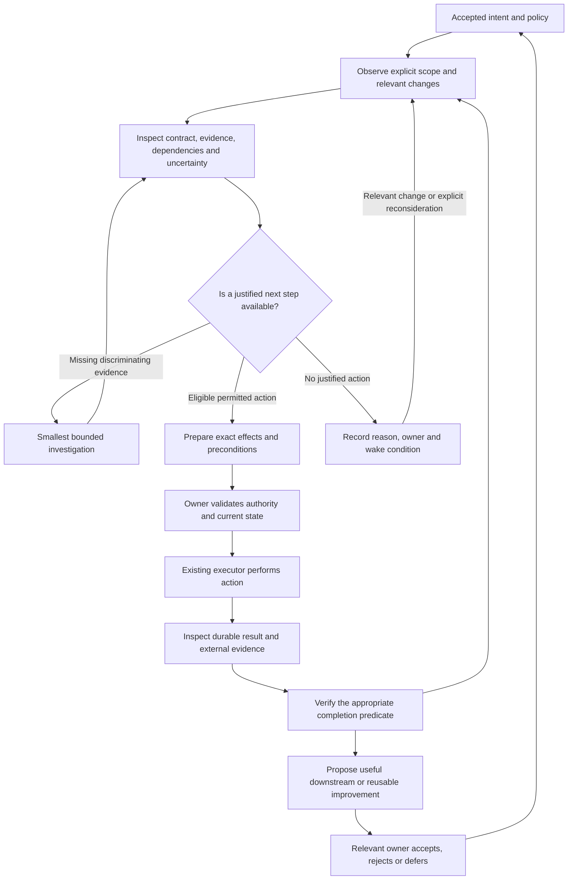

# Factory as an agent-native system

Status: **proposal for review, not an accepted execution or authority change**. Prepared 2026-09-11 UTC. No programme hold, issue scope, installed engine, provider permission, or release policy is changed by this document.

## Read by decision

- **Direction and system model:** this document.
- **Implement an interface or handoff:** [Agent system contracts](agent-system-contracts.md).
- **Choose sequencing, ownership, or acceptance:** [Implementation and qualification plan](agent-system-plan.md).
- **Check what exists and what was actually observed:** [Grounding and evidence](agent-system-grounding.md).

These documents connect existing programmes; they do not replace their accepted contracts. Implementation status is pinned in the grounding record, not inferred from future-tense examples below.

## 1. The central decision

**Make Factory a system for preserving intent, evidence, and control across verified changes. Agents supply judgment inside that system; they are not its persistent state.**

From the driver's seat, the expensive part is not typing a command. It is reconstructing the situation well enough to know which command is justified: which repository and engine I am observing, what outcome matters, which work is actually authorized, what changed since the last attempt, whether a result still applies, and whether an earlier action already happened.

A coherent Factory should let me answer six questions without rediscovering its implementation:

1. **Why?** Which accepted outcome and constraints justify this work?
2. **What is true?** Which observations support the present account, at which revisions, with what omissions?
3. **What changed?** Which relevant facts or contracts changed since the last decision?
4. **What can I do?** Which actions are implemented, permitted, eligible, and worth considering?
5. **What happened?** What did an action actually accomplish, and what remains unresolved?
6. **What carries forward?** Which verified result changes the next task, the remaining plan, or a reusable practice?

The goal is not maximum autonomous activity. It is **maximum useful, verified progress within explicit authority and resource limits**. Correctly declining, deferring, or asking one necessary question can be the best result.

### Three requirements

| Property | Meaning | Observable failure |
| --- | --- | --- |
| Agent-intuitive | The vocabulary and navigation match decisions about work, not storage layout or implementation stages. | An agent must know which log filename or private helper explains a case. |
| Agent-ergonomic | Common investigations and authorized actions require little reconstruction, with useful partial results and exact recovery instructions. | Repeated broad reads, guessed commands, ambiguous success, or starting an already-running job again. |
| Agent-accretive | Accepted experience improves subsequent decisions without turning accumulated prose into implicit policy. | Successful findings vanish, stale notes dominate, or speculative lessons become permission. |

These are properties of the entire loop, not features of a chat interface.

## 2. A tower of linked abstractions

The tower describes **meaning and drill-down**, not an agent reporting hierarchy and not one new module per row.

| Level | Question it hides for its caller | Existing or proposed owner | Links that must remain traversable |
| --- | --- | --- | --- |
| Portfolio and operating policy | Which repositories and outcomes deserve attention within host and human constraints? | District owns registered repositories and host policy; humans own product priorities and authority. | Repository identity, accepted outcome, capacity/resource evidence. |
| Outcome / initiative | What externally observable result matters, and what does success mean? | Existing collaboration programme and its accepted initiative contract; standalone issues need no fabricated initiative. | Approved revision, decision owner, contributing work, outcome evidence. |
| Work contract | What bounded change may be attempted now? | Existing issue intake, dependency/admission and ownership machinery. | Parent outcome if present, scope revision, prerequisites, acceptance criteria, exclusions. |
| Execution | What attempt or decision is actually happening? | Dispatcher, workers, gate, reviewer, manager; existing lifecycle owner. | Work contract, execution/root/parent IDs, effective policy, budget, wait and terminal result. |
| Result and delivery | What artifact was produced, verified, integrated, and eventually made available? | Existing gate/review/merge owners; separately authorized release/outcome owners. | Exact heads, reports, PR, merge commit, release/installation evidence, unmet criteria. |
| Evidence and substrate | Why should any of the above be believed, and what can be safely executed? | Git/GitHub, lifecycle journal, retained artifacts, Linux process/lock evidence, host configuration. | Immutable content/revisions, source times, observation coverage, capabilities and executor identity. |

**Downward:** “Why is this outcome delayed?” reaches the blocking contract, its execution, and the specific missing evidence.

**Upward:** “This implementation exposed a limitation” reaches the consumer contract and outcome owner who can decide whether to amend the plan.

**Sideways:** “What else does this change affect?” follows declared work dependencies and revision-specific code relationships, without mistaking a code dependency for authorization or scheduling precedence.

A level earns its abstraction when its caller can use it without understanding everything underneath. It must nevertheless expose a drill-down link when the abstraction is insufficient. A green summary with no route to its evidence is not depth; it is opacity.

## 3. One linked account, not one database

Factory already has multiple legitimate authorities. Git owns code revisions. GitHub owns current issue/PR facts. The lifecycle journal owns recorded execution transitions. Linux supplies current process and lock observations. District owns host configuration. An authorized human decision owns intent or permission.

**Coherence means one owner for each fact and explicit links between owners—not copying everything into a new authoritative store.**

Build derived views over existing IDs. Keep the small relationship vocabulary in the [contracts](agent-system-contracts.md#2-identity-and-relationships). Start with links present in real records; unavailable relationships stay unavailable. A derived reverse lookup or cache is disposable and cannot authorize an action.

Three distinctions must survive every abstraction:

- **Observation / inference / decision / authorization.** A worker's report is an observation about what the worker claims. Corroborating source or a gate result supports particular claims. A manager recommendation is a judgment. Neither creates permission.
- **Source time / observation time / applicability.** Reading an old approval today does not refresh it. A new head can make valid historical evidence inapplicable without making its historical result false.
- **Completion at different levels.** Process exit, successful attempt, accepted change, merge, release, installation, and achieved product outcome are different predicates. One `done` flag cannot represent them.

Existing schema-1 observations already preserve many of these distinctions. The design extends their reach rather than replacing them.

## 4. The agent's operating loop

Only the unresolved judgment step needs a model. Collection, comparison, eligibility, limits, identity binding, execution, and receipts should remain deterministic where their rules are known. An unchanged idle pass needs no model call.

### A decision-ready view

The first useful response is not a complete dump of the repository. It is a bounded account of the selected work: objective and scope link; current evidenced state; relevant change; blocking condition; available next reads/actions; budget remaining when known; source and coverage links.

Use progressive disclosure: **scope overview → selected work → decisive evidence → exact source**. The agent may inspect broadly when the question requires it, but every broad read should answer a named uncertainty. A resource limit is not permission to silently drop a constraint.

Recommendations should name the observation that would change them. If that observation is cheap and available within the authorized read scope, acquire it rather than asking the human to perform repository research. If the uncertainty is product intent, permission, or an unresolved trade-off, ask the actual decision owner.

### Control is an affordance, not a shell escape

A closed action menu describes what the current executor supports. Each candidate has a target, effects, prerequisites, authority requirement and result meaning. “Implemented,” “permitted,” and “eligible now” are independent.

Preparation produces an exact proposal, not permission. Application uses the existing owning lock/guard, rechecks relevant state, and returns a durable result. Console, dashboard, and unattended manager must not implement competing versions of that rule. Missing capability remains explicit; a natural-language promise cannot create an executor.

The FM reasons and arranges work. Workers implement within admitted scope. Gates and independent review verify. Existing human checkpoints protect changes to Factory's own authority and verification. A model family difference may diversify review, but is not proof of statistical independence or correctness.

## 5. Deep modules at real seams

The primary design move is **less knowledge required at each interface**.

| Module | Small interface to aim for | Complexity hidden / retained owner |
| --- | --- | --- |
| Evidence | Observe a scope; inspect an identified object; investigate an explicit question target; discover support. | Source selection, bounds, provenance, revision association and partial failure; extend the existing evidence owner. |
| Work admission and control | Prepare an allowed action; apply a trusted decision; inspect its recorded result. | Eligibility, ownership, drift, duplicate suppression and external reconciliation; use existing manager/dispatcher owners and C3/B5 work. |
| Execution | Run one admitted contract; expose causal lifecycle and a result. | Worktree/process/gate/reviewer coordination; existing dispatcher, not a new workflow engine. |
| Context | Produce the smallest relevant boot/resume packet from accepted facts and pointers. | Scope binding, freshness, selection and omissions; reconcile with existing claim-time brief work. |
| Learning | Propose and inspect an evidenced improvement under an existing owner. | Source retention, applicability, acceptance and retirement; evolve existing lessons/notes and outcome work. |

These are design seams, not instructions to create five new classes or services. Put implementation changes in existing owners first. A shared helper earns extraction when dashboard, console, manager or worker genuinely consumes the same behavior. Internal test substitution should not widen the public interface.

**Deletion test:** removing a module should force meaningful complexity back into several callers. If deleting it merely removes pass-through methods, it should not exist.

## 6. Accretion: experience should make the system easier to operate

Accretion is not “remember everything.” It is **retain the smallest verified improvement at the lowest durable level that can prevent repeated work**.

Preferred order:

1. Fix a recurring defect or clarify the module interface itself.
2. Preserve a runnable acceptance/regression check for a plausible failure.
3. Record a stable domain rule or a narrow operational recipe next to its owner.
4. Retain an evidence-linked lesson when the improvement cannot yet live in code or a check.
5. Keep raw logs as inspectable evidence, not default prompt context.

A successful worker can reveal an important constraint on the next task. A failed worker can reveal a local repair. Those are different questions; one failure-heavy prompt should not consume all planning attention. The local handoff experiment supports investigating that distinction, but does not qualify autonomous replanning or prove cost savings.

The upward path is explicit:

**result → corroborated observation → proposed plan/lesson delta → owner decision → revised contract or scoped practice → later measured outcome.**

The original approved scope remains in force until its owner accepts a change. Rejected and superseded suggestions remain identifiable so the system need not rediscover them. Retention is bounded, repository-scoped and subject to deletion/privacy requirements; append-only execution evidence does not mean retain all private text forever.

A useful agent can say “the implementation disproved an assumption; pause admission to this dependent work and ask its owner,” when existing policy permits that hold. It cannot silently rewrite an initiative to make the implementation look successful.

## 7. Resource efficiency is a whole-loop property

Optimize **cost per accepted useful outcome**, not tokens per response or number of tickets closed. Include model cost, tool I/O, elapsed time, scarce-resource occupancy, repeated work and human correction time. Report missing measurements; do not turn unknown cost into zero.

High-leverage reductions come before new infrastructure:

- Reuse exact-revision evidence and deterministic briefs instead of repeatedly collecting or generating them.
- Send relevant changes on retries, with links to the unchanged contract and full prior evidence, rather than concatenating every historical narrative.
- Give agents a small role-specific context and discoverable task skills; avoid unrelated always-loaded instructions.
- Let cheap deterministic checks settle known conditions; call a model for ambiguity, not polling.
- Schedule only eligible work, respect declared dependencies, limit overlapping edits and scarce-resource contention, and explain starvation. Add graph-aware ranking only when measured rework or queue behavior justifies it.
- Use success as well as failure evidence. Preventing a bad downstream admission can save more than shortening one prompt.

Graphify remains a revision-pinned optional navigation aid. Its code edges are not a planning oracle, proof of complete impact, or permission. Test narrow symbol/neighbor retrieval against current brief/source lookup before making extraction part of every worker start. A whole-repository map in every prompt pays cost even when it answers no question.

A cheaper model or shorter packet is accepted only if it preserves relevant correctness and safety. First-edit time alone is not success: a worker that understands too little can edit quickly and produce expensive rework.

## 8. The entire lifecycle, using the same loop

The existing autonomy programme owns the delivery waves. This design provides their common shape, not twelve replacement schedulers.

| Loop | Decision-level closure |
| --- | --- |
| Intake/reconciliation | Every in-scope candidate has an evidenced disposition; exclusions and unknown discovery coverage remain visible. |
| Viability/prioritization | Build, decline proposal or defer has a reason and reconsideration condition; assessment is not implementation authority. |
| Clarification/specification | Repository-answerable gaps are investigated; missing intent has a decision owner and a defined reply/re-triage condition. |
| Planning/dependencies | Admitted work binds an accepted contract; completed prerequisites release only the relationships they actually satisfy. |
| Implementation/validation | An attempt produces acceptance-specific evidence or a bounded, attributable failure. |
| Review/remediation | Required feedback refers to its source/head and has a disposition; repeated unchanged feedback does not spawn endless repairs. |
| Integration/freshness | Gate, review, approval and merge preconditions apply to the exact candidate head and correct target. |
| Operational recovery | Partial effects and unknown liveness are reconciled before replay; resource waits are not guessed product failures. |
| Release/rollout | The authorized revision is released/installed and verified; merge alone is insufficient. |
| Publication/roadmap | Public claims derive from actual delivery records; implemented/unreleased and available remain distinct. |
| Product outcome | The relevant owner evaluates the original success evidence, not merely closure of children. |
| Learning/qualification | A proposed improvement is adopted only with applicable evidence; regressions retire it. |

Every waiting state needs **reason, owner or unresolved ownership, wake condition, budget/termination rule and next permitted inspection**. A timer is a wake mechanism; it is not a reason to repeat the same judgment. See the [plan](agent-system-plan.md) for integration with existing owners.

## 9. Driver-seat walkthroughs

### “Why has this PR not moved?”

I select the repository and PR, see its current head and the unmet eligibility facts, then inspect only the disputed sources. “No passing CI observed” is not “CI failed.” A complete tree showing a missing workflow at that PR head differs from a permission error. If a workflow repair is needed, I propose scoped worker work preserving verification—not a bypass. I inspect the work receipt and later exact-head evidence before saying the PR is ready.

### “Resume the work you were doing yesterday.”

The session reloads the accepted contract and prior decision identity, refreshes capabilities and relevant external state, and inspects any pending effect. It does not rely on chat memory to conclude that a worker stopped or that a comment was never posted. A changed head invalidates the old action proposal, not the historical record. I continue from the next justified decision, not from the beginning of the repository tour.

### “This succeeded; what should we change next?”

The retained result links to exact implementation and verification evidence. I compare discoveries with known downstream contracts. A display parser that truncates content might require a consumer to bind full canonical content or refuse admission. I return that specific proposed amendment to its existing owner. Successful code acceptance does not release the consumer's hold or approve a new outcome.

### “Can we go faster?”

I inspect where time and repeat work occur. If two workers wait on the same exclusive gate resource, increasing worker count may not help. If a repeated context omission causes revision bounces, fix the brief or interface. If no measured bottleneck is available, run a bounded observation first. “More agents” is an option to justify, not the default architecture.

## 10. What this proposal deliberately does not add

No universal knowledge graph database, distributed event bus, permanent manager conversation, second scheduler, new fleet registry, arbitrary agent-to-agent protocol, or automatic self-modification. No mandate that every outcome be an initiative. No requirement to generate all possible edges or summaries before useful work can start.

The ambitious part is the consistency of the contracts: **an agent can move from intent to evidence to authorized action and back to improved understanding without changing mental models or losing provenance.** The implementation should be incremental and mostly deepen machinery Factory already owns.
