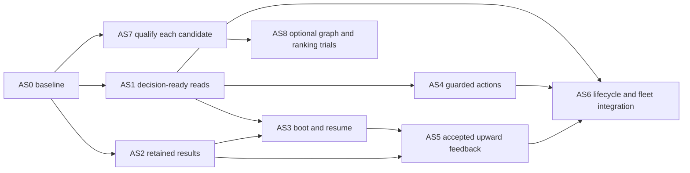

# Agent-native Factory: implementation and qualification plan

Status: **proposed, not queued or authorized for execution**. This plan operationalizes [the system design](agent-system-design.md) and [contracts](agent-system-contracts.md). It grants no new automation, provider access, publication, deployment or hold release. Planning handles `AS0`–`AS8` below are not GitHub issue numbers.

## 1. Start with a vertical decision loop, not a platform

**Recommended first implementation outcome:** a fresh agent can accurately explain one selected case, its accepted purpose, relevant changes, missing evidence and supported next step through the existing shared reader—without reading Factory's internal source or confusing the checkout with the installed engine.

That yields immediate usefulness without granting more mutation authority. In parallel, preserve successful result evidence so later context/learning work has something real to consume. Then connect the existing guarded-action programme and prove one complete loop. A new hierarchy, graph store or general orchestrator is not a prerequisite.

Completion of this proposal set is not completion of the programme below. Each slice needs accepted source, actual behavior evidence and its named release checkpoint.

## 2. Reconcile existing ownership before creating work

Canonical source baseline for this proposal is `c75a5a7a384693d2c377fab7a543242535cde77d`. Read [the grounding record](agent-system-grounding.md) before relying on status. Dated plans are not a live queue.

| Concern | Existing owner / source | What this plan adds, not duplicates |
| --- | --- | --- |
| Lifecycle, waits and local observation | F01/#26, F02/#27, F03/#28; lifecycle/runtime modules | Navigable links and targeted history where justified. No replacement journal or liveness model. |
| Shared evidence and console | C1 is canonical; local C0–C6 [console plan](fm-console-plan.md) owns packaging, guarded actions and continuity | Decision-ready views and common identity/applicability; reuse C2–C6 rather than a new chat product. |
| Claim-time brief and worker metrics | Canonical `brief.py`, `dispatch.build_prompt`, `stats.brief_metrics` / `worker_metrics` | Revision-aware reuse, selective resume context and stronger outcome measurement. Do not rebuild T8 as if absent. |
| Source-versioned PR feedback | B2/#79 is closed and the collector is on pinned main | Consume its accepted schema. The older autonomy-plan statement “B2 unpublished” is historical. |
| Sustained PR follow-up | #15/B3; B2 handoff remains its separate acceptance checkpoint | Source-revision-aware next action and truthful receipt integration; no rival feedback dispatcher. |
| Guarded actions / receipts | C3/C4/C5 and B5; existing dashboard/manager/dispatch writers | One owning policy/apply seam, not a new general mutation menu. |
| Initiatives, owners and scoped admission | #52 and #53–#59 | Connect their accepted facts to agent inspection and downstream refinement. Preserve their dependency graph and holds. |
| Full issue-to-outcome lifecycle | [Existing autonomy execution plan](https://github.com/mikeroySoft/factory/blob/c75a5a7a384693d2c377fab7a543242535cde77d/docs/autonomy-execution-plan.md), L01–L12/A1/I1 | Common trigger/basis/action/result/wait contracts across existing units. Not twelve new tickets. |
| Learning and qualification | Existing learn/manager notes, #34 calibration, local handoff experiments | Earned retention, actual adoption/outcome measurement and retirement of stale knowledge. |
| Fleet / host | District registry, apply/install ownership; C6 and gated T12 | Explicit scope selection and shared evidence links. No bulk control or second fleet registry. |
| Code map | Existing Graphify-backed `codebase.py` and history viewer | Optional narrow retrieval trial only after comparison with current briefs. |

#53's accepted reader landed through PR60 on `stable`. This investigation pinned stable at `92cd1e86232992f95a2db3e7f74261aadfb82428`, read its `factory/plan.py`, and confirmed PR60 targeted stable; the same path returned 404 on pinned main. Before any initiative consumer is implemented, verify source availability on the selected current branch and agree its integration method. Issue closure is not an implementation import. #55–#59 remain subject to their actual existing release conditions; this plan releases none.

Before publishing or amending a ticket: refresh issue body/labels/assignees, relevant PR heads/diffs, claims, installed contract support and ownership. Amend existing unclaimed work where it owns the outcome. Coordinate claimed work with its owner. Never encode `Blocked by: #AS2`, use a programme parent as a blocker for its own children, or invent a permanent dependency to manage shared-file scheduling.

## 3. Delivery slices

The existing lane vocabulary applies: **Direct** means an operator-owned non-`agent/<n>` implementation branch with independent review, normal gates and human merge approval; **Factory** means ordinary admitted worker/gate/independent-review delivery; **Human checkpoint** means explicit approval of the exact policy, external effect or deployment. Read-only direct qualification does not require a code branch until it changes source. A slice that gains authority/verification behavior moves to Direct before that work begins.

### AS0 — Freeze a decision-quality baseline

**Outcome:** we can tell whether a proposed ergonomic improvement helps rather than merely shortens output.

- **Lane:** direct read-only qualification; any provider experiment needs separate disclosure/cost approval.
- **Inputs:** current installed capabilities, accepted source revisions, existing calibration and handoff protocols; local prototype UX acceptance.
- **Work:** freeze representative source bundles and independently adjudicated answers for the eight scenario families in §5. Include complete, partial, stale, conflicting and unavailable evidence. Record which operations and source reads a fresh agent actually needs. Reuse experiment conventions; no new benchmark framework.
- **Acceptance:** every case names its question, sources, authority, expected correct distinctions, stop rule and measurable outcome. Baseline runs retain prompts/settings/raw outputs and coverage. No implied success from a nicely formatted response.
- **Out of scope:** live issue mutations, collecting unrelated private sessions, repairing production or widening any policy.
- **Handoff:** frozen case IDs, source manifest and baseline table. Missing token/cost data is null with reason. This is the prerequisite for claiming efficiency improvement, not for designing the contracts.

### AS1 — Make selected work decision-ready

**Outcome:** one existing read interface answers “what is this work, why is it blocked, what changed, and what can I inspect next?” with exact scope and applicability.

- **Lane:** Factory for the read-only producer/consumer once the contract is accepted.
- **Owners/touches:** `factory/evidence.py`, shared case selection in `dashboard.py`, `briefing.py`, `runtime_events.py` / `runtime_local.py` only if a missing primitive is proven; `cli.py` and public interface docs where needed. One evidence integrator owns shared consumer edits.
- **Work:** add verifiable reader identity and negotiated support; expose bounded typed object/source links and independent state predicates using existing producers. Derive known blockers from actual recorded eligibility/wait facts, not from guessed policy. Support comparison against a named prior basis; mark unsupported/partial comparisons honestly. Ordinary issue inspection works without an initiative reader.
- **Acceptance:** run the real JSON CLI against disposable Git/state and controlled GitHub read responses. A workflow absent at the PR head, green checks on another head, missing permissions and a truncated history produce four distinct answers. Read repeated unchanged sources without generating new semantic events. Dashboard and console display the same references. State directory remains unchanged by these reads.
- **Out of scope:** actions, new eligibility policy, a global object database, mandatory code extraction or installed deployment.
- **Dependency:** AS0 for comparative qualification; accepted existing C1/F03/B2 producer contracts. Initiative links are admitted only after their separately accepted reader exists on the implementation baseline; that does not block ordinary-case usefulness.
- **Removal criterion:** retire caller-specific reconstruction only after both actual consumers use the same accepted projection. Keep F03's separate network-free path.

### AS2 — Preserve trustworthy successful results

**Outcome:** a successful result and its provenance remain inspectable after normal worktree cleanup.

- **Lane:** bounded evidence production may use Factory; a direct control-plane integrator owns any changed cleanup/failure behavior.
- **Owners/touches:** existing dispatch worker/cleanup points, lifecycle journal writer, briefing/evidence artifact readers. Reuse the prospective handoff pilot's demonstrated content/observation distinction, not its session-scoped observer as production machinery.
- **Sizing prerequisite:** first inspect byte-size metadata of already-existing authorized handoff artifacts, without copying or retaining their contents. The owner selects provisional caps and failure/cleanup policy from that bounded inventory. If originals are unavailable, use declared synthetic sizes to qualify mechanics and keep real-volume suitability unknown; the retention policy does not depend on AS2 already running.
- **Work:** capture complete available handoff bytes and a small execution/head/contract manifest before cleanup; atomically publish the artifact then journal its reference. Represent unavailable/oversized/unstable source honestly. Replays retain original observations; same bytes across separate events do not collapse their provenance.
- **Acceptance:** real disposable worktree lifecycle exercises successful capture, two same-time equal-byte events, crash between blob and reference, replay, missing handoff, changed head, unsafe path and storage failure. After normal cleanup, a fresh process retrieves the original accepted capture by ID and distinguishes worker claims from verification.
- **Out of scope:** automatic lesson generation or plan changes, copying all transcripts, extending verification authority, or treating capture failure as a failed gate.
- **Dependency/checkpoint:** artifact retention, disclosure, storage caps and cleanup-on-capture-failure policy must be accepted before production implementation/deployment. AS0 supplies evaluation cases; AS1 integration can follow the producer without making capture depend on the UI.
- **Handoff:** producer schema/examples, actual capture limits, storage/read errors, retention behavior and exact accepted source revision.

### AS3 — Make boot and resume context relevant and revision-aware

**Outcome:** workers reuse applicable context without carrying stale briefs or repeatedly reconstructing unchanged work.

- **Lane:** ordinary context production can use Factory; changes to admission or authority go Direct.
- **Owners/touches:** `factory/brief.py:ensure/compose`, `dispatch.build_prompt/worker_round`, existing templates and metrics. Preserve one prompt owner.
- **Work:** retain current deterministic brief generation; associate reusable content with its actual code/contract/producer basis. A changed scope or code basis makes affected references historical or triggers bounded refresh, not silent reuse. Supply current required feedback and previous checkpoint as a delta. Avoid duplicating whole lessons and matched lesson excerpts when that duplication provides no benefit. Keep mandatory constraints retrievable and identified.
- **Acceptance:** two attempts on unchanged inputs reuse the same applicable brief; a relevant contract/head change cannot reuse it as current. An independently failed source stays unknown. A fresh worker resumes an actual partially completed disposable task and satisfies its original acceptance condition without restarting completed external work. Compare correctness, full-loop cost and repeated reads with AS0, not only time to first edit.
- **Out of scope:** new models, broad skill rewrites, mandatory Graphify, automatic scope amendment or larger worker budgets.
- **Dependencies:** AS2 for durable cross-cleanup result context; AS1 for shared inspectable links. Initial cache-basis correction can be prepared independently under the same owner.
- **Rollout:** one explicit opt-in worker cohort after the candidate meets §6; preserve the accepted previous prompt/context configuration for rollback.

### AS4 — Complete one guarded action loop across consumers

**Outcome:** console, dashboard and unattended control use the same accepted action semantics and produce inspectable causal results.

- **Lane:** Direct; this changes Factory's authority machinery. Human acceptance and deployment are separate.
- **Owner/reuse:** C3/C4 and B5, coordinated with #15's existing execution owner. `dashboard.act`, manager apply paths, dispatch/lifecycle records and their real consumers are likely integration seams, not permission to refactor unrelated subprocess code.
- **Work:** start with a trusted operator-confirmed **answer-and-retriage** operation on one open, selected `needs-info` issue: post the exact approved comment, then add `needs-triage` and remove `needs-info`. Recheck scope, holds, claims and takeover before effects; refuse conflicts rather than unassigning anyone. This composes existing dashboard effects and never directly dispatches a worker or treats a reporter reply as authorization. Implement shared prepare/basis/authorization/apply/receipt semantics and migrate every caller of that supported operation, preserving deadlines and bounds. Unattended callers may use the shared guard only with independently accepted authority; this human-only operation grants them none.
- **Acceptance:** real CLI/UI interaction in a disposable authorized environment proves inspect → proposal → trusted confirmation → existing action → receipt → fresh-session inspection. Race two clients: one accepted effect or an explicit conflict, never two independent mutations. Inject failure after the first external step, inability to persist intent/final receipt, changed head/target/owner, forged confirmation and cancellation. Replays do not repeat ambiguous effects.
- **Out of scope:** increasing autonomous powers, overriding programme holds, self-approval, bulk fleet actions, release or protected verification edits.
- **Dependencies:** AS1; accepted C3 menu/authorization mechanism; A1 controls needed for the selected action; #15/B5 handoff where its result ownership is involved. B5 consumer work must not become an artificial prerequisite blocking #15.
- **Cutover:** retire old supported-operation paths in the same source integration; do not deploy until all affected clients are compatible. Rollback disables the new action capability and returns to a known-safe release, never to a bypassing legacy path.
- **Milestone boundary:** this first operation proves the seam, not completion of all C3/C4/B5 behavior. Their existing supported-menu and scoped implementation-delegation requirements still need acceptance through the same seam. The programme exit in §8 requires real delegated implementation and its result, not merely a successful comment or re-triage.

### AS5 — Feed accepted results back into the remaining plan

**Outcome:** useful implementation discoveries become specific, owner-reviewed downstream amendments rather than lost notes or autonomous scope changes.

- **Lane:** Factory for bounded read-only evidence/consumer work; Direct/human for contract changes and admission policy.
- **Owner/reuse:** #52/#56/#57/#58, existing notes/learn, AS2 retained results, the existing handoff experiments. No separate outcome planner service.
- **Work:** compare captured discoveries with explicit downstream contracts; propose at most the useful deltas, including zero. Preserve success findings separately from immediate repair triage. Record owner acceptance/rejection/defer alongside existing authoritative plan discussion, with source links and unchanged authority. Promote general lessons only through §6.
- **Acceptance:** extend the existing prospective protocol only through its owner; do not restart or alter the currently waiting #6→#7 pilot. On an authorized captured case, accepted refinement is source-supported and tied to its consumer. A held consumer stays held. Suffix-only changes beyond a display cap are detected from complete canonical content or admission is refused. A fresh session sees the same accepted amendment and rejects superseded guidance.
- **Dependencies:** AS2/AS3; #57 integration before any changed contract affects admission; #56 where a routed human decision is required. Read-only proposals can be evaluated before action integration.
- **Out of scope:** automatic backlog replanning, promoting worker claims into policy, new roles or provider calls on every successful ticket.

### AS6 — Apply the shared model across lifecycle and fleet views

**Outcome:** every existing loop exposes its own trigger, evidence basis, result and wait/re-entry condition using common inspectable references.

- **Lane:** existing autonomy-plan lane per loop; District owns host/fleet changes.
- **Owner/reuse:** L01–L12, collaboration programme, C2/C5/C6 and District projections. Do not open one broad “finish all autonomy” coding ticket.
- **Work:** add the relevant contract fields as each already-owned loop is implemented. Keep intake assessment distinct from permission, reply distinct from re-entry, feedback observation distinct from delivery, merge distinct from release/install/publication, and outcome declaration with its owner. Fleet navigation selects a registered repository and clears stale proposals/context.
- **Acceptance:** each enabled loop passes the applicable scenario families in §5 through its actual owning interface; record per-loop accepted/held/unsupported status. Read-only fleet navigation can be accepted without release automation. Release/install/publication/outcome acceptance requires its separately authorized real-world checkpoint; controlled local stand-ins cannot claim it. Unsupported loops visibly lack actions rather than borrowing another stage's success. All applicable families are required at the final programme checkpoint, not as an all-or-nothing gate on each incremental view.
- **Dependencies:** AS1 for shared observation; AS4 only for each enabled action; AS5 for downstream learning. Per-loop original prerequisites/holds still govern. C6 read-only navigation need not wait for every action or release loop.
- **Out of scope:** multi-runner coordination, a new fleet controller, copying private repository knowledge across scopes.

### AS7 — Qualify efficiency improvements and retire harmful context

**Outcome:** lower repeated work and operating cost are demonstrated without degrading accepted quality or authority.

- **Lane:** read-only/ordinary experiment infrastructure may use Factory; model, routing, authority, budget and rollout changes require their existing Direct/human checkpoints.
- **Owner/reuse:** stats/learn, #34 calibration and existing experiment records; no new evaluation framework.
- **Work:** run the comparisons in §6, record full denominators and missing coverage, and retain or remove each candidate context/lesson change based on observed value. Separate model, prompt and tool changes to identify their contribution.
- **Acceptance:** a reproducible baseline/candidate report names accepted useful outcomes, required-defect misses, unnecessary review demands, factual/authority errors, total available cost and human effort. Unsupported broad generalizations are explicitly excluded. Failed candidates leave production unchanged.
- **Dependencies:** AS0 and the relevant candidate, not every earlier slice. Measurement runs alongside delivery rather than becoming an end-only dashboard.

### AS8 — Evaluate optional structural navigation and scheduling leverage

**Outcome:** determine whether narrow code-neighborhood retrieval or declared-dependency ranking buys more than existing briefs and source lookup.

- **Lane:** read-only experiment first. Any scheduling policy change is Direct; neither is currently authorized.
- **Owner/reuse:** `codebase.py` optional extractor and existing scheduler/brief owners.
- **Work:** compare baseline brief, baseline plus exact-revision extracted neighbors, and ordinary targeted source inspection on matched tasks. Measure build/retrieval/token costs as well as downstream misses and rework. Separately inspect declared work dependencies for measurable repeated conflicts, critical-path blockage or starvation before trialing a deterministic ranking.
- **Acceptance:** keep Graphify optional unless the comparison shows a material repeatable benefit after all costs. Missing/unsupported extraction leaves normal source investigation usable; inferred/unresolved edges cannot authorize work. Scheduling changes preserve eligibility/locks, explain ranking and show bounded fairness under continuing arrivals.
- **Dependencies:** AS7 establishes the relevant baseline and decision threshold. No dependency from ordinary operation to AS8.
- **Stop rule:** no material benefit, added factual errors, or excessive maintenance means do not integrate. A useful visualization alone does not establish worker savings.

## 4. Execution waves and shared mutation ownership

Arrows describe semantic inputs. They do not create GitHub blocker lines, release held work or imply every AS6 read-only integration waits for all three inputs. AS7 qualifies each candidate when available, not after AS6 finishes. Existing programme prerequisites remain additional constraints.

1. **Acceptance/baseline:** accept the system direction and first contracts; perform AS0 and refresh owners. No code change is implied by reviewing these documents.
2. **Evidence/context:** AS1 and AS2 share the evidence/briefing reader seam; one named evidence integrator serializes those edits. Only their non-overlapping producer/discovery work runs concurrently. AS3 consumes accepted handoffs; dispatch/journal integration remains with its owning integrator.
3. **Control and upward feedback:** AS4 and the read-only portion of AS5 can proceed independently once their own prerequisites are accepted. They do not negotiate different identity or authority models.
4. **Lifecycle adoption:** integrate AS6 into existing authorized waves; qualify each change through AS7.
5. **Optional leverage:** AS8 only when measurements justify it.

Name one integration owner for each mutation seam before dispatching a wave:

- dispatch/manage/triage and action authority;
- lifecycle/runtime/artifact writer and retention semantics;
- evidence/dashboard/briefing and console adapters;
- config/onboarding and District host contracts;
- shared public docs and schema examples.

Agents may research disjoint slices concurrently. Shared-file edits are serialized at the owner, not “resolved later” by merging competing policies. No candidate running engine approves its own control-plane changes. Preserve the current dirty checkout/prototypes; implementation starts from an agreed clean canonical baseline, without resetting, stashing or copying unrelated local state.

## 5. Acceptance scenario families

Each family has an independently adjudicated expected answer/effect, not just a valid JSON shape. These are required qualification cases for the affected slice, not nine redundant tests for every module.

| Family | Adversarial case | Pass criterion |
| --- | --- | --- |
| Orientation | Checkout, installed CLI, service and remote integration target differ. | Correctly identifies observed versus unknown identities; uses discovered support, not assumed version parity. |
| Evidence/CI | Green main CI, no runs on PR head; missing workflow versus forbidden read; source changes mid-read. | Distinct cited facts and bounded next investigation; no fabricated failure, absence or readiness. |
| Scope/dependencies | Initiative edited during work; suffix changes beyond display cap; child closes without outcome evidence. | Complete contract binding or refusal; explicit drift; no inferred delivery or released hold. |
| Feedback/replay | Same source polled twice, edited review, rerun check, partial page hiding an old thread. | Semantic revisions distinguished; no duplicate delivery, disappearance or acknowledgement from partial evidence. |
| Action/concurrency | Two consumers apply; human takes over; final response is lost after an external effect. | Same authority/preconditions; durable result or unknown/partial reconciliation; no blind replay. |
| Execution/resources | Reused PID, surviving child, replaced lock inode, exclusive gate wait, truncated execution history. | Known liveness/ownership preserved; uncertainty explicit; no kill/unlock/re-dispatch based on age or missing tail rows. |
| Accretion | Useful successful discovery, plausible false handoff, stale lesson, rejected plan delta. | Corroborates before promotion, preserves disposition and scope, measures later use; zero automatic authority escalation. |
| Delivery/fleet | Merged-only change; release unavailable on selected host; switch repository with pending proposal. | Separate completion predicates; exact scope selection; no leaked instructions/proposals or claimed installation/outcome. |

For each new logical contract, keep the smallest deterministic regression defending a plausible failure. For interface integration, invoke the actual CLI and exercise the actual UI. For live external effects, use a separately authorized disposable target and retain provider receipts. Existing verification policy remains `python -m unittest discover -s tests` on the current canonical source; run it once after integration, not independently in every subagent. No new test framework is required.

## 6. Measurements and adoption gates

### Measure at the decision and outcome levels

| Measure | Denominator / caveat |
| --- | --- |
| Grounded decision correctness | Independently adjudicated cases, including correct uncertainty and necessary non-action; not citation count. |
| Unjustified action proposals / unauthorized effects | Cases with the relevant authority trap and actual guarded-action scenarios. Zero observed violations is a gate, not proof of zero future risk. |
| Accepted useful outcomes | Original acceptance/outcome predicate; report declined/deferred correct dispositions separately from delivered changes. |
| Full-loop cost | Known model input/output/cache cost + tool work + scarce-resource time + human correction/review effort; expose missing portions. Do not sum incompatible units into a fake dollar total. |
| Reorientation/repeated reads | Repeated acquisition of unchanged relevant sources per attempt/resume; first-edit time is secondary. |
| Required-defect misses / unnecessary REVISE | Independent defect-bearing and clean cases, stratified by task class and head. Gate pass is not a ground-truth oracle. |
| Upward-feedback usefulness | Supported nonduplicate recommendations, owner adoption, downstream use and observed avoided/caught rework; suggestions alone are not savings. |
| Continuity quality | Fraction of sampled resumed decisions with retrievable complete applicable basis/result; show expired/missing evidence. |
| No-progress/idle spend | Model calls and repeated effects for unchanged evidence; target zero idle model calls. |
| Stalls/fairness | Age and reason of eligible but unserved work, resource waits and re-entry latency with observed coverage. |

Existing worker/brief metrics are reusable but observational: a higher first-gate pass rate in one cohort does not prove its brief caused the difference. Different task difficulty, model versions, retries and missing cost data confound it.

### Recommended qualification protocol

1. Freeze the problem cases, source revisions, expected distinctions, prompts/tool envelopes, model/settings and scoring rules before candidate trials. Predeclare one primary efficiency metric, its measurement coverage, the confirmation sample/analysis and quality/secondary-cost guardrails; do not choose model cost versus human time after seeing results. Separate repair, orientation and outcome-planning questions.
2. For read/context candidates, compare paired cases using the same model/settings with two fresh repetitions per condition as an initial screening floor. Eight scenario families give coverage, not a statistically meaningful reliability estimate. Blind adjudication where feasible; record any condition leakage.
3. Hold out additional cases for confirmation. Include both routine and difficult tasks, partial sources and scope changes. Obtain explicit provider disclosure/budget approval before any model calls; use deterministic local probes for contract boundaries where inference is unnecessary.
4. Reject any candidate with an observed unauthorized effect, newly missed mandatory constraint, incorrect completeness promotion or lost required defect in these cases. Mixed/uncertain results do not authorize rollout.
5. The two-repetition screen only selects candidates for held-out confirmation; it cannot establish an efficiency claim or authorize rollout. Proposed confirmation target: at least 20% lower median on the predeclared primary metric (measured full-loop model cost or human investigation time), with no quality regression or breach of the other cost/latency guardrails. Evaluate on the predeclared held-out sample, report paired per-case differences, tails, uncertainty and missing coverage. This is a proposed decision threshold, not an observed gain or universal SLO. Insufficient sample/coverage or uncertain benefit means inconclusive, not permission to integrate.
6. Canary only after acceptance, on explicitly selected ordinary tasks under unchanged authority. Observe real adoption and correction cost. Roll back the candidate prompt/reader/action release on a correctness regression; keep evidence of the failure for diagnosis.

Change one principal lever at a time: context, retrieval, tool surface, model, or policy. Fewer calls can mean either efficiency or insufficient investigation; the acceptance oracle distinguishes them.

### When to stop adding machinery

- If existing brief/source lookup performs as well as a graph, keep the graph out of worker startup.
- If a lesson is never retrieved or no longer applies, retire its default-context presence; retain only required history.
- If a shared module saves no caller knowledge, collapse it into its actual owner.
- If an index is not needed to meet observed read bounds, do not add it.
- If a proposed action has no enforceable authorization and recovery contract, leave it unavailable.

## 7. Decisions to settle before the affected implementation

These are review checkpoints, not questions that block writing this proposal.

| Decision | Recommendation | Owner / affected slice |
| --- | --- | --- |
| First useful deliverable | AS1 ordinary-case decision-ready reads, alongside AS2 evidence retention; no new autonomous actions. | Product/integration owner. |
| Authority expansion | None by default; reuse existing accepted menus and A1/C3 checkpoints. | Human/control-plane owner, AS4. |
| Artifact retention | Bounded repository-local evidence, full capture or explicit failure; select caps/TTL and privacy/removal policy from observed artifact sizes before deployment. Keep verification records distinct from optional narrative. | Host/evidence owner, AS2. |
| Context ceiling | Trial 24 KiB additional continuity/brief content; preserve complete contract access and hard constraints. Adjust only from measured cases. | Context owner, AS3. |
| Plan refinement | Human/accepted owner review; no automatic scope rewrite or hold release. | Existing #52/#57 owner, AS5. |
| Model/provider experiment | Same-model paired comparison first; explicit disclosure and cost approval. | Human, AS0/AS7/AS8. |
| Portfolio priorities | Read-only explanation initially; no hidden priority weights or autonomous capacity increase. | Product owner and District host owner. |
| Source deployment | Pinned accepted build, explicit client/schema compatibility, previous safe revision and post-install proof. | Human/District checkpoint. |

Existing intake/reply, isolation, release, publication and two-human-pilot choices remain with the original autonomy/collaboration programmes. This proposal does not replace those decisions with guessed defaults.

## 8. Done means the complete loop works

Programme acceptance requires a fresh agent to orient correctly; investigate a real uncertainty; recommend a justified next step; prepare and execute one permitted action through the shared guard; inspect its true outcome after restart; and carry one accepted, corroborated improvement into subsequent work without losing scope, provenance or authority. Then demonstrate cross-repository isolation through District and the separate release/outcome predicates where those stages are enabled.

Report measured correctness, resource use, residual unknowns and remaining explicitly held capabilities. Read-only usefulness is a legitimate first delivery, not a claim that the whole agent-native system is complete. No implementation, ticket publication, deployment or provider experiment is authorized by this plan alone.
