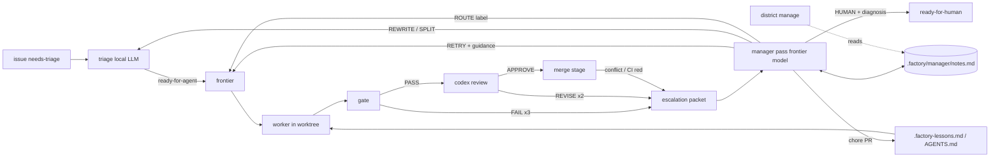

# Factory manager: research and plan

Research date: 2026-09-04. Sources: the user's GitHub stars May–Sep 2026 (19 repos read at
primary source) and 12 vendor/practitioner write-ups on hierarchical coding agents.

## 1. The proposal, restated

A persistent frontier-model agent that (a) acts where the human acts today on escalations,
(b) holds memory that outlives any one ticket, (c) optimizes workers by giving them the right
context, and (d) lays out the task graph and picks or builds the harness per job. Possibly
tiered: 1 General Manager → 3 Supervisors → 11 workers.

## 2. Where the human acts today

Every path into `escalate()` in `factory/dispatch.py` flips the ticket to `ready-for-human`,
unassigns, and comments. The trigger set is closed:

| Trigger | Site | Evidence already on disk |
|---|---|---|
| gate FAIL × `max_attempts` | `process_ticket` | gate report, attempt logs, handoff |
| wall-clock budget exceeded | `process_ticket` | attempt logs |
| branch has no commits over main | `process_ticket` | worker log |
| REVISE after `review_rounds` | `process_ticket` | PR comments with `path:line` findings |
| gate FAIL after review bounce | `process_ticket` | gate report |
| rebase onto moved main conflicts | `refresh_pr_branch` | worktree kept |
| gate FAIL after rebase | `refresh_pr_branch` | gate report |
| CI red on approved PR | `merge_pass_locked` | `gh pr checks`; label removed |
| upstream sync conflict / gate fail | `sync_escalate` | separate `ready-for-human` issue |

Plus non-`escalate()` human points: `needs-info` answers, `wontfix-proposal` confirmation,
`ready-for-human` triage decisions, dashboard inbox answers, committing `.factory-lessons.md`.

The factory skill's **Diagnose** section is already a written procedure a human follows
(events → comment → gate report → review findings → log → act at the cause). That is the
manager's job description; it is not open-ended.

## 3. What the research says

### 3.1 Consensus across sources

- **Durable state on disk, ephemeral sessions.** Anthropic's long-running-agent harness
  (`claude-progress.txt` + JSON feature list), Codex long-horizon (`Documentation.md`),
  Gas Town ("sessions are disposable; Beads persist"), firstmate (durable wake queue, tokenless
  watcher), supergoal (`STATE.md`, phase files). Nobody recommends a long-lived process as the
  source of truth. [1][2][3][4][5]
- **Workers get a bounded brief, not the big picture.** Anthropic research system, Cursor
  planner/worker split, OpenAI manager pattern, Gas Town molecules. [6][7][8][3]
- **No vector store by default.** Anthropic SDK guidance calls semantic search "less accurate,
  less transparent, harder to maintain" than agentic filesystem search; Codex, Gas Town, rowboat,
  supergoal, graphify all use Markdown/JSON/Git. [9][10][11]
- **Hierarchy only where slices are genuinely independent.** Cognition's counterargument
  (parallel workers make unshared design decisions) and Anthropic's own note that coding has
  fewer safely parallel slices than research. Cursor *removed* its integrator tier because it
  bottlenecked. [12][6][7]
- **Self-declared completion is unreliable; deterministic verification is the defense.**
  Universal. The factory's gate already is this.
- **Bound every retry loop with a counter and a durable record.** Gas Town re-escalation limit,
  supergoal's 3-strike `BLOCKED`, paperclip's hard budget pause, openworker's 5-denial pause,
  headlong's watchdog/iteration caps. [3][5][13][14][15]
- **Prune harness scaffolding as models improve.** Anthropic 2026 harness guidance. [16]

### 3.2 Mechanisms worth stealing (with the repo that has them)

| Mechanism | Source | Factory mapping |
|---|---|---|
| Structured escalation record: severity, ack, re-escalation count | Gas Town `docs/design/escalation.md` [3] | `.factory/escalations/<n>.md` + `escalate` event fields |
| Escalation packet: criterion, attempts/probes, fix spec, next move | supergoal `PROTOCOL.md` [5] | same file |
| Decide → durable decision record → act → terminal outcome | OpenBot gateway/audit [17] | `manage` event before the `gh` call |
| Closed decision menu, code applies it | openworker role-constrained transitions [14] | `DECISION:` line parsed like `VERDICT:` |
| Persistent scoped supervisor "home", idle until woken by event | firstmate secondmates [4] | manager runs per dispatch pass over `.factory/manager/` |
| Natural-language routing rules → harness/model/effort | firstmate `crew-dispatch.json` [4] | `[workers]` gains a `when` field |
| Two-stage memory: cheap append at task time, background consolidation with a verified cursor | vellum-assistant retrospective job [18] | `events.jsonl` is the buffer; `factory learn` is the consolidator (exists) |
| Gardener that promotes recurring evidence into dated key facts, marks stale | rowboat `note_curation` [11] | manager consolidates `notes.md` at end of run |
| Per-worktree untracked scratch for handoffs | helmor `.agent-contexts/` [19] | `.factory/handoff-<n>.md` (exists) |
| Deterministic, confidence-labeled code map; refuse to overwrite a fuller map with a partial one | graphify [10] | optional input to ticket briefs, later |
| Baseline/delta structural signal as a decision input, not a verdict | sentrux `gate --save` [20] | optional gate check, later |
| Pre-spawned workers spend no tokens until assigned; human approves the roster | openworker team registry [14] | routing labels are the roster; host config is the approval |

### 3.3 What to avoid

- Gas Town's full role taxonomy (Mayor/Deacon/Witness/Refinery/Dogs). Its author's own warning:
  expensive, chaotic, immature, optimized for throughput over reliability. [3]
- Paperclip/OpenBot control planes (Postgres, org trees, CEL policy). Factory already has a
  ticket pipeline; it needs a narrow resolver. [13][17]
- Understand-Anything's LLM-heavy whole-repo graph per ticket (significant init tokens). [21]
- A manager that manufactures a task graph to create parallelism (Anthropic, Cursor). [6][7]
- Conversation-as-task-graph (agent-orchestrator). Represent dependencies explicitly. [22]

## 4. Position

### 4.1 Agree

1. **A frontier agent at the escalation point is the highest-leverage, lowest-risk addition.**
   Escalations are rare (bounded by `max_attempts`, `review_rounds`, `budget_min`), the evidence is
   already structured, the procedure is already written, and the action set is closed. Cost is
   bounded by escalation rate.
2. **Memory outliving workers: yes, as files.** `.factory-lessons.md` (committed, worker-facing)
   and `events.jsonl` (buffer) already exist. Add one manager-facing notes file. No database.
3. **Worker optimization through context: yes, and the levers already exist.** A worker's harness
   is `worker binary + repo AGENTS.md + repo skills + .factory-lessons.md + prompt`. The manager
   optimizes workers by curating the committed files (via PRs that pass gate + review + human) and
   by choosing routing labels. `learn.py` already names the eval signal: first-gate pass rate.

### 4.2 Push back

1. **Fixed 1 → 3 → 11 is premature.** The hierarchy already exists in the infrastructure:
   host (District) → repo (factory) → ticket (worker). `~/.config/factory/config.toml` registers
   three repos; `max_active` per repo gives the worker count. Map the tiers onto that:
   *GM = District-level pass over the fleet; Supervisor = per-repo manager; Workers = as today.*
   Numbers fall out of config. Do not add a tier that has no independent slice to own.
2. **"Persistent agent" must mean persistent memory, not a persistent process.** Every source
   says state on disk, sessions ephemeral, wake on events. A daemon adds crash, context-bloat,
   and race modes, and fights the systemd-timer architecture. The manager runs inside the
   dispatch pass, reads its notes, acts, writes its notes, exits.
3. **"Lays out the graph": only on evidence, never proactively.** Tickets are the graph;
   `Blocked by: #N` are the edges. The manager may *split* a ticket when an escalation says it is
   too big, and manager-authored tickets go through triage like everyone else's. It does not
   re-plan the backlog.
4. **"Builds harnesses": start with routing and context curation; measure; only then build.**
   New `[workers]` entries live in host config (District-owned) and need a human to apply.
   Purpose-built agent definitions are phase 3, gated on phase 2 metrics showing routing +
   context curation is insufficient.
5. **Authority boundary is the design.** Decided 2026-09-04; see §4.3. The one invariant that
   makes the FM a safe merge authority: **the FM never writes code.** Workers write, the host
   gate verifies, codex reviews the diff, the FM reviews with history and decides — four
   independent signals, none self-approved. Conflict resolution, CI fixes and REVISE follow-ups
   are always dispatched as worker rounds.
6. **Measure before building.** Anthropic: add complexity when measured outcomes justify it.
   Ticket 1 is the baseline.

### 4.3 Authority boundary (decided)

The happy-path merge is already autonomous (`merge_pass_locked`: gate PASS + `factory-approved`
\+ green CI + head contains `main`); the human only blocks. Release branches (`release/*`) hold
stability, so `main` may absorb FM risk. Decisions taken: FM final review runs on escalated PRs
only (`manager.review = "escalated"`; `"all"` available); human-authored PRs are out of scope
for v1 (v2 extends the PR frontier to them); wontfix on human issues stays proposal-only.

| Action | FM autonomous | Rule |
|---|---|---|
| Relabel / rewrite / split / route ticket | yes | bounded by `rounds` |
| Dispatch a worker round (`ci-fix`, `conflict`, REVISE follow-up) | yes | profile chosen by `[workers].when` |
| Re-add `factory-approved` after a red-CI escalation | yes | after gate PASS + fresh codex APPROVE |
| Final merge review on a PR | escalated/flagged PRs | the "trusted authority with memory" gate |
| Merge to `main` | yes | FM adds/withholds the label; the merge stage merges |
| Close a factory PR (`agent/*`) as wontfix | yes, with diagnosis | the PR is the factory's attempt |
| Close a factory-created child issue (from SPLIT) | yes | FM created it |
| Close a human-authored issue as wontfix | **no** | `wontfix-proposal` + comment; the reporter owns intent |
| Shepherd human-authored PRs | **no (v1)** | v2: PR frontier includes them |
| Push `release/*`, cut a release, hotfix a release | **no** | the stability guarantee behind everything above |
| Edit `[[gate.check]]`, `[leak_scan]`, `.github/workflows/*` | PR only; human merges | the FM must not weaken its own verification |
| Edit `AGENTS.md` / skills / `.factory-lessons.md` | PR; FM may merge after codex APPROVE | context, not verification |
| Change `[workers]` / `[manager]` host config | recommend in diagnosis | human/District applies |
| Raise `max_active` / `budget_min` | within `[defaults.manager]` caps | hard pause at the cap |

**FM owns the PR loop; specialists are worker profiles, not a tier.** QA is already three
independent signals (host gate, codex, GitHub CI). The judgment states in the PR loop are
closed — red CI (flake vs real vs infra, which needs FM notes), non-converging REVISE, stale PR —
so a deterministic PR frontier handles the rest and calls the FM only for those. `ci-fix` and
`conflict` are `[workers]` entries with `when` rules, routed like `chore`.

**Models (decided 2026-09-04).** FM = `openai-codex/gpt-6-astra`; reviewer =
`anthropic/claude-fable-5-1`; both run through `omp -p` so a model change is one `--model`
flag. Rule: FM and reviewer stay on different model families, so the merge precondition is two
independent verdicts, not one model grading itself with more context. `codex exec` is retired
from the pipeline (it cannot run a non-OpenAI model). Workers unchanged; an astra worker profile
for hard tickets is a `[workers]` entry with a `when` rule once #20 lands.

### 4.4 Loop-safety and trust rules

- `manager_rounds` per ticket (default 1). Exhausted → `ready-for-human` with the manager's
  diagnosis attached. A `manage` event is written *before* the `gh` mutation (decide → record →
  act).
- If a human has commented or changed labels since the escalation, the manager skips the
  ticket: a human took it.
- Manager comments carry a fixed prefix (`Factory manager:`) so `build_prompt`, the dashboard
  and humans can attribute them.
- Issue bodies and comments are untrusted input. The manager's decision menu is closed and
  applied by code; the manager gets no shell in the main checkout. If it needs to read code it
  reads the kept worktree.
- One frontier call per escalation, not per pass. Idle passes cost nothing.

## 5. Architecture after the plan

## 6. Tickets

Ordered; `Blocked by` gives the edges. Each is one observable change with a checkable exit gate
(`.github/ISSUE_TEMPLATE/agent_task.md` shape). Phase 0–1 is the deliverable that replaces the
human at the escalation point; later phases are gated on its metrics.

### Phase 0 — Baseline

**T1. Human-touch metrics in `factory stats` and the dashboard**
- Scope: for each finished ticket, report escalation count, who resolved each escalation
  (human vs. factory; detectable from label-change actor on the issue timeline), minutes in
  `ready-for-human`, and re-queue count. Aggregate: escalations/week, % resolved by human.
- Touches: `factory/stats.py`, `factory/dashboard.py` (`metrics()`), `dashboard.html` KPI row.
- Exit gate: `factory stats` prints the new columns for the existing `events.jsonl`; the
  dashboard KPI row shows escalations/week and human-resolved %.
- Out of scope: any manager behavior.

### Phase 1 — Manager at the escalation point

**T2. Structured escalation packet** — Blocked by: none
- Scope: `escalate()` writes `.factory/escalations/<n>.md` (reason, attempt table from
  `events.jsonl`, last gate report tail, latest review findings, handoff text, log paths,
  worktree path) and the `escalate` event carries `packet` path and `round` (escalations so far
  for this ticket). `sync_escalate` writes the same shape for `upstream`. Deterministic; no LLM.
- Touches: `dispatch.py` `escalate`, `sync_escalate`, `record`.
- Exit gate: a forced gate failure (`--ticket N` against a ticket whose check is `false`)
  produces the packet with every section populated; `tests/test_factory.py` asserts the shape.
- Out of scope: reading the packet.

**T3. `[manager]` config table** — Blocked by: none
- Scope: `[manager] command = [...]` (argv template with `{prompt}`, `{cwd}`; default unset =
  disabled), `rounds = 1`. Host-layer table like `review` (`HOST_TABLES`). `factory doctor`
  reports the binary; `dashboard --json` `config` includes it.
- Touches: `config.py` (`KNOWN_KEYS`, `HOST_TABLES`, `Config`, loader), `onboard.py` doctor,
  `templates/factory.toml`, `dashboard.py`.
- Exit gate: `factory doctor` prints a `manager:` row when configured and nothing when not;
  unknown keys under `[manager]` are reported as drift.
- Out of scope: running it.

**T4. `factory manage` stage** — Blocked by: T2, T3
- Scope: new module `factory/manage.py`, run at the top of the dispatch pass (after
  `land_pass`, before `frontier`). For each open issue labeled `ready-for-human` that has a
  packet, no human activity since the escalation, and `round <= manager.rounds`: build a prompt
  from packet + `.factory-lessons.md` + `.factory/manager/notes.md` + the closed decision menu;
  run `manager.command` with `cwd` = the kept worktree (or `ROOT` read-only if none); parse the
  final `DECISION: RETRY|REWRITE|SPLIT|ROUTE|HUMAN` line plus a body. Apply by code:
  RETRY → comment `Factory manager: <guidance>`, relabel `ready-for-agent`;
  REWRITE → comment with the old body, `gh issue edit --body`, relabel `ready-for-agent`;
  SPLIT → create sub-issues labeled `needs-triage` with `Blocked by` lines, comment on the
  parent, leave the parent `ready-for-human` until children close;
  ROUTE → add/remove a label that exists in `[workers]`, relabel `ready-for-agent`;
  HUMAN → comment the diagnosis, stay. Unparseable output = HUMAN. Record `manage` event
  (`decision`, `round`, `packet`) before the `gh` calls.
- Touches: `manage.py` (new), `dispatch.py` `main`, `cli.py`, `config.py`.
- Exit gate: with a fake manager command (`printf 'DECISION: RETRY\n...'`), a `ready-for-human`
  ticket with a packet is relabeled `ready-for-agent` with the prefixed comment and a `manage`
  event; a second escalation of the same ticket is left alone (rounds exhausted); a ticket with a
  human comment after the escalation is skipped. All three in `tests/test_factory.py` with `gh`
  stubbed as the existing tests do.
- Out of scope: memory write-back; sync escalations; any decision outside the menu.

**T5. Manager notes: read, write-back, consolidation** — Blocked by: T4
- Scope: `.factory/manager/notes.md` (gitignored). Every manager prompt includes it. The manager
  ends its output with a fenced `notes` block that replaces the file; the code caps it at N KB
  and refuses an empty replacement of a non-empty file (graphify's "don't overwrite a fuller
  artifact"). Prompt instructs: date each note, keep only evidence-backed, recurring items
  (flaky check names, ticket-author patterns, what RETRY guidance worked), drop stale ones.
- Touches: `manage.py`, `.gitignore` via `onboard.py` `GITIGNORE_LINES`.
- Exit gate: two consecutive fake-manager runs show the second prompt containing the first
  run's notes; an empty `notes` block does not truncate the file.
- Out of scope: lessons file; cross-repo.

**T6. PR frontier: the FM shepherds every open `agent/*` PR to a terminal state** — Blocked by: T4
- Scope: alongside the ticket frontier, list open `agent/*` PRs and map state → action:
  CI pending → wait; behind main → `refresh_pr_branch` (exists); CI red / rebase conflict /
  gate-after-rebase / REVISE not converging / stale (no activity > N days) → escalation packet
  → FM. FM decisions for PRs add `FIX` (dispatch one `worker_round` in the kept worktree with the
  guidance as `extra`, re-gate, push, re-review; re-add `factory-approved` only on a fresh
  APPROVE) and `CLOSE` (close the PR with a diagnosis; the linked issue gets `wontfix-proposal`
  unless the factory created it). `manager.review = "escalated" | "all"` selects whether the FM
  also reviews non-escalated PRs before the label is granted. Bounded by `rounds` per PR.
  Human-authored PRs are excluded (v1).
- Touches: `manage.py`, `dispatch.py` (`worker_round`, `review`, `approve_pr`, `merge_pass_locked`).
- Exit gate: a PR whose `factory-approved` label was removed by red CI is, after a fake-manager
  `FIX` and a green gate + APPROVE, relabeled `factory-approved` and merged on the next pass;
  a fake-manager `CLOSE` on a human-authored issue's PR closes the PR and labels the issue
  `wontfix-proposal` without closing it; a human-authored PR is never listed in the frontier.
- Out of scope: upstream sync issues (T12); `release/*` (never).

### Phase 2 — Context provisioning (worker optimization)

Gate: T1 shows ≥ 4 weeks of manager data and the human-resolved % dropped.

**T7. Manager-run `factory learn` opens a chore PR** — Blocked by: T5
- Scope: when `[manager]` is set, `factory learn` uses `manager.command` instead of the triage
  model, includes `notes.md` as evidence, and instead of writing the file in `ROOT` it commits
  `.factory-lessons.md` on `agent/lessons-<date>` and opens a PR labeled `chore` so gate, review
  and the human see it. Eval remains first-gate pass rate before/after (already in the doc
  string of `learn.py`).
- Touches: `learn.py`, `dispatch.py` `push_and_pr`.
- Exit gate: `factory learn` with the fake manager opens a PR containing only
  `.factory-lessons.md`; without `[manager]` the current behavior is unchanged.
- Out of scope: AGENTS.md edits.

**T8. Per-ticket brief at claim time** — Blocked by: T5
- Scope: before attempt 1, a deterministic pass produces `.factory/brief-<n>.md`: files
  matched by `git log -S`/grep of ticket nouns, the last 3 merged PRs that touched them, the
  triage `Agent brief` comment, matching lessons. Token-capped. Appended to the prompt as
  `## Brief`. No LLM in v1; the manager may later rewrite the brief on RETRY.
- Touches: `dispatch.py` `build_prompt`, new `brief.py`.
- Exit gate: a ticket naming a symbol yields a brief listing the file that defines it and the
  last PR that changed it; `factory stats` shows first-gate pass rate split by tickets with/
  without a brief.
- Out of scope: knowledge-graph tooling (graphify) — revisit if grep-based briefs plateau.

**T9. Manager proposes harness-context changes as chore PRs** — Blocked by: T7
- Scope: a new manager decision `CURATE` (only from `factory learn`, never from an escalation)
  that edits `AGENTS.md` / `.omp/skills/**` / `CONTRIBUTING.md` in the target repo on
  `agent/curate-<date>`, opens a `chore` PR with the evidence (which tickets, which notes). Human
  merges via the normal flow.
- Touches: `learn.py`, `manage.py`.
- Exit gate: fake manager emitting `CURATE` with a diff opens a PR touching only the listed
  paths; a `CURATE` from an escalation packet is rejected and recorded.
- Out of scope: gate check edits (`[[gate.check]]` stays human-only).

### Phase 3 — Routing and specialization

Gate: T8 metrics by label show a worker type losing consistently on a ticket class.

**T10. Per-label pass rates** — Blocked by: T1
- Scope: `factory stats` and the dashboard split first-gate pass rate, attempts and cost by the
  worker label that ran the ticket (`claimed` event already records labels).
- Exit gate: `factory stats --by-worker` prints one row per `[workers]` key.

**T11. Routing rules the manager can read; `ci-fix` and `conflict` profiles** — Blocked by: T4, T10
- Scope: `[workers.<label>]` may carry `when = "<natural-language description>"` (firstmate's
  `crew-dispatch.json` pattern). The manager prompt lists labels with their `when`; `ROUTE` and
  `FIX` are only accepted for listed labels. Ship two default profiles in `templates/factory.toml`:
  `ci-fix` (read the failing job log, fix or declare flake with evidence) and `conflict` (resolve
  the rebase, keep both intents, no semantic changes). New profiles are still added by a human in
  host config (District-owned); the manager may recommend one in a HUMAN diagnosis.
- Touches: `config.py` (`[workers]` becomes table-or-array), `manage.py`, `dashboard.py`,
  `templates/factory.toml`.
- Exit gate: a `ROUTE chore` decision on a repo without a `chore` worker is rejected and
  recorded; with one, the label is applied; a `FIX` on red CI runs the `ci-fix` argv.
- Out of scope: the manager writing host config.

### Phase 4 — General Manager (fleet)

Gate: ≥ 2 repos with T5 notes and T10 data.

**T12. `district manage`** — Blocked by: T5, T10, T11
- Scope: one fleet pass per hour (District's metrics timer) that runs `manager.command` with
  every repo's `notes.md` + metrics, and may: set per-repo `max_active`/`budget_min` within host
  caps declared in `[defaults.manager]`, take the upstream-sync `ready-for-human` issues through
  the same RETRY-in-worktree path, and write `~/.config/factory/manager-notes.md` (fleet-level
  patterns). All mutations are recorded in District's registry with a reason.
- Touches: District, not this repo, except for `[defaults.manager]` keys in `config.py`.
- Exit gate: `district status --json` shows the last GM decision per repo with its reason;
  a cap in `[defaults.manager]` is never exceeded in a fake-manager run.
- Out of scope: cross-repo tickets; any tier between GM and per-repo manager.

### Explicit non-goals

- No daemon; the manager is a stage in the dispatch pass.
- No vector store or memory service; `events.jsonl` + Markdown files.
- No FM code edits, `release/*` pushes, wontfix on human issues, verification-config merges,
  or self-approval.
- No proactive backlog re-planning; decomposition only from an escalation.
- No new worker binaries until T10 shows routing and context curation is insufficient.

## Sources

1. Anthropic, Effective harnesses for long-running agents — https://www.anthropic.com/engineering/effective-harnesses-for-long-running-agents
2. OpenAI, Run long horizon tasks with Codex — https://developers.openai.com/blog/run-long-horizon-tasks-with-codex
3. Gas Town — https://raw.githubusercontent.com/gastownhall/gastown/HEAD/README.md, https://raw.githubusercontent.com/gastownhall/gastown/HEAD/docs/design/escalation.md, https://steve-yegge.medium.com/welcome-to-gas-town-4f25ee16dd04
4. firstmate — https://raw.githubusercontent.com/kunchenguid/firstmate/HEAD/docs/architecture.md, https://raw.githubusercontent.com/kunchenguid/firstmate/HEAD/.agents/skills/quota-array-dispatch/SKILL.md
5. supergoal — https://raw.githubusercontent.com/robzilla1738/supergoal/HEAD/skills/supergoal/templates/PROTOCOL.md
6. Anthropic, How we built our multi-agent research system — https://www.anthropic.com/engineering/multi-agent-research-system
7. Cursor, Scaling long-running autonomous coding — https://cursor.com/blog/scaling-agents
8. OpenAI, A practical guide to building agents — https://openai.com/business/guides-and-resources/a-practical-guide-to-building-ai-agents/
9. Anthropic, Building agents with the Claude Agent SDK — https://claude.com/blog/building-agents-with-the-claude-agent-sdk
10. graphify — https://raw.githubusercontent.com/Graphify-Labs/graphify/HEAD/ARCHITECTURE.md
11. rowboat knowledge/curation — https://github.com/rowboatlabs/rowboat/tree/main/apps/x/packages/core/src/knowledge, https://raw.githubusercontent.com/rowboatlabs/rowboat/main/apps/x/packages/core/src/knowledge/note_curation.ts
12. Cognition, Don't Build Multi-Agents — https://cognition.com/blog/dont-build-multi-agents
13. paperclip V1 spec — https://raw.githubusercontent.com/paperclipai/paperclip/master/doc/SPEC-implementation.md
14. openworker teams — https://raw.githubusercontent.com/andrewyng/openworker/HEAD/coworker/teams/tools.py, https://raw.githubusercontent.com/andrewyng/openworker/HEAD/coworker/teams/store.py
15. headlong thinkers — https://raw.githubusercontent.com/laude-institute/headlong/HEAD/design/THINKERS_spec.md
16. Anthropic, Agent Harness Design — https://claude.com/blog/harnessing-claudes-intelligence
17. OpenBot gateway/audit — https://raw.githubusercontent.com/CopilotKit/OpenBot/HEAD/docs/architecture.md, https://raw.githubusercontent.com/CopilotKit/OpenBot/HEAD/server/src/computer/gateway.ts
18. vellum-assistant memory — https://raw.githubusercontent.com/vellum-ai/vellum-assistant/main/assistant/docs/architecture/memory.md, https://raw.githubusercontent.com/vellum-ai/vellum-assistant/main/assistant/src/plugins/defaults/memory/memory-retrospective-job.ts
19. helmor agent contexts — https://raw.githubusercontent.com/dohooo/helmor/main/src-tauri/src/workspace/agent_contexts.rs
20. sentrux — https://raw.githubusercontent.com/sentrux/sentrux/HEAD/docs/quality-signal-design.md
21. Understand-Anything — https://raw.githubusercontent.com/Egonex-AI/Understand-Anything/HEAD/understand-anything-plugin/skills/understand/SKILL.md
22. agent-orchestrator — https://raw.githubusercontent.com/Untrivial-ai/agent-orchestrator/HEAD/docs/architecture.md
23. Hindsight — https://hindsight.vectorize.io/developer/observations (consolidation pattern; not adopted as a store)
24. swarm-forge handoff protocol — https://raw.githubusercontent.com/unclebob/swarm-forge/main/swarmforge/handoff-protocol.md
25. Herdr socket API — https://herdr.dev/docs/socket-api/
26. Sourcegraph, Agentic Coding in 2026 — https://sourcegraph.com/blog/agentic-coding

## UX handoff addendum — 2026-09-05 (local planning only)

This section records the approved narrow UX direction and exact **proposals**, not
implemented behavior, published issues, release permission, or operator acceptance.
The historical manager research above remains intact. In particular, its proposed
autonomous authority must not be read as a description of today's Inbox FM.

### Authority, evidence, and existing ownership

- **Current:** Inbox and contextual Ask FM are read-only, evidence-cited advice.
  `briefing.SYSTEM` forbids action claims; `run_model` uses a bounded no-tools,
  no-session invocation and never executes the configured manager command.
  Confirmed human actions separately call `/api/act`; the existing preview explains
  exact effects, next owner, reversibility, stale-state refusal, and partial outcomes.
  These are features to preserve, not tickets to build another Inbox.
- **Proposed, separately gated:** the manager in §§4–6 may make bounded decisions
  through the existing dispatch pipeline after its prerequisites are accepted.
  Factory #13 depends on #11/#12; #15 is the existing PR-frontier implementation
  owner. Neither configuration nor FM advice grants that future authority today.
  Workers write code; deterministic gate, independent review, CI, current-main
  checks and human veto remain mandatory. No new controller, desktop application,
  persistent-session authority, or unsolicited terminal injection is proposed.
- **Factory/District boundary:** Factory owns project decisions and execution truth.
  District keeps the approved Overview / Flows / Brief programme and consumes
  public Factory CLI JSON, never private imports or parsed worker logs. Ordinary
  CI failure, review revision and project escalation are not machinery incidents.
- **Accepted source versus installation:** Factory #26/F01 closed through merged
  [PR #29](https://github.com/mikeroySoft/factory/pull/29), merge
  `14496db16753e2f41b1ac38b750f2ca78fb904fd` at `2026-09-05T17:56:04Z`.
  Its PR body reports gate PASS, two CI gate checks report SUCCESS, and its review
  comment ends `VERDICT: APPROVE`. This is existing acceptance evidence, not a
  fresh gate run or proof of the installed engine. The orchestration owner's
  18:35–18:36Z isolated installed-package inspection found Factory 0.2.0 without
  `factory.lifecycle` or `--runtime-json`; its noneditable local-file installation
  has no recorded VCS revision. Local `main` at `36cf1da` is also not the merged
  F01 source. Compatible installation remains a separately authorized checkpoint.
- **Current ownership:** the live refresh found Factory #10/#11/#12 still assigned
  with open PR #24/#23/#22 respectively. All three PRs have `factory-approved`,
  gate PASS in their bodies and no reported CI checks. The observed dispatcher
  refusal is `no passing CI checks reported; refusing to merge`; the old board
  phrase `human merge pending` is an explanation gap, not permission to bypass CI.
  The underlying absence of checks is undiagnosed here. No current lock does not
  release an assignee's or an open PR's ownership. F02/#27 and F03/#28 remain held,
  with no intake labels. Refresh ownership again before any later amendment.

Pinned source evidence read for this addendum:

| Evidence | Relevant source at accepted F01 revision |
| --- | --- |
| Lifecycle keys, outcomes, interruption limits and legacy semantics | [README execution event contract](https://github.com/mikeroySoft/factory/blob/14496db16753e2f41b1ac38b750f2ca78fb904fd/README.md#execution-event-contract), [`lifecycle.py`](https://github.com/mikeroySoft/factory/blob/14496db16753e2f41b1ac38b750f2ca78fb904fd/factory/lifecycle.py): `Execution`, `observe`, `_rows` |
| Actual eligibility, admission and claim boundaries | [`dispatch.py`](https://github.com/mikeroySoft/factory/blob/14496db16753e2f41b1ac38b750f2ca78fb904fd/factory/dispatch.py): `pr_checks`, `merge_pass_locked`, `frontier`, `process_ticket`, `record` |
| Migrated phase, remaining artifact history, decision receipt identity | [`dashboard.py`](https://github.com/mikeroySoft/factory/blob/14496db16753e2f41b1ac38b750f2ca78fb904fd/factory/dashboard.py): `phase_of`, `snapshot`, `build_ticket`, `disk_state`, `act` |
| Existing consumer and misleading readiness explanations | [`dashboard.html`](https://github.com/mikeroySoft/factory/blob/14496db16753e2f41b1ac38b750f2ca78fb904fd/factory/dashboard.html): `renderKpis`, `card`, `inboxItems`, `stageTimeline`, `tabTimeline`, `tabAttempts`, `applyDecision` |
| Advisor authority and bounded decision evidence | [`briefing.py`](https://github.com/mikeroySoft/factory/blob/14496db16753e2f41b1ac38b750f2ca78fb904fd/factory/briefing.py): `SYSTEM`, `run_model`, `sources_for` |
| Approved cross-repository boundary and acceptance | [District specification, immutable baseline](https://github.com/mikeroySoft/district/blob/164663b1a3e5e78b4fde3b127cf013d87b7e3c28/OPERATIONS-CONSOLE-SPEC.md), especially §§3, 6–7, 10–11 |

The live Factory issue/PR bodies were also read, including #5–#15 and #26–#28;
they govern ownership and dependencies rather than the old T-number shorthand.
Factory's current `.factory.toml` gate is `python -m unittest discover -s tests`.
The older manager issues, including #10–#15, still cite
`uv run pytest tests/test_factory.py`; #5–#9 cite bare `python -m unittest`.
Reconcile affected acceptance commands to explicit discovery at an authorized,
unclaimed contract boundary. Do not rewrite #10–#12 under their open PRs or
install pytest to satisfy stale planning text. This planning pass runs no gates.

Exact proposed acceptance-command reconciliation (no GitHub edits performed):

| Existing Factory issues | Proposed text change | Ownership / release condition |
| --- | --- | --- |
| #10, #11, #12 | Replace only the inline command `uv run pytest tests/test_factory.py` with `python -m unittest discover -s tests`; retain their behavioral acceptance requirements | Assigned, PR-owned work: defer body changes until the owning worker/PR handoff is complete. A passing command does not establish their missing CI or merge readiness. |
| #13, #14, #16, #17, #18, #19, #20 | Same exact command-only substitution; retain each issue's current real `Blocked by:` lines and Scope / Touches / Exit gate / Out of scope | Currently unassigned, but re-read immediately before any authorized amendment. Never change an issue claimed since this snapshot; materially revised contracts return through normal triage, not direct ready-for-agent. |
| #15 | The complete B3 replacement below supersedes its stale command and preserves its existing manager prerequisite and meaningful scope | Publish only after B2 has a real issue number and at an unclaimed contract boundary; no body/label changes now. |
| #21 | Same command substitution is recorded for a later owner, not queued for this UX wave | The fleet-manager proposal is outside this addendum's implementation scope; this is not permission to launch another District controller or release that work. |
| #5–#9, #26–#28; District #23–#31 | No acceptance-command/body change beyond the exact scoped programme amendments in the District ticket ledger | The external-review lane is distinct; existing console issues already name the correct repository gates. |

No package installation, workflow edit or CI-policy change is proposed to make a stale command pass. Any later publication must use the then-current gate configuration and preserve worker ownership, rather than mechanically applying this dated table.

### Outcome reconciliation and implementation order

| Outcome | Reuse before adding work | Remaining gap and proposed disposition |
| --- | --- | --- |
| B1: truthful PR readiness and admission explanation | Existing board, Inbox, briefing facts and merge stage; F02/#27 owns capacity, known waits and resources | New narrow factory-PR explanation ticket below. #8/#9 remain the opt-in **external** review/readiness queue, blocked through #5–#7; do not redefine their `ready` as Factory merge authority or make this fix wait for external-PR intake. |
| B2: structured later feedback | Existing full snapshot, Review/Inbox and read-only briefing; #11 supplies packets but not later provider review/thread/check provenance | New narrow producer ticket and exact schema below. Reuse one collector across evidence consumers and #15; do not add GitHub reads to F03 runtime JSON. |
| B3: bounded follow-up delivery | Existing #15 and its #13 → #11/#12 manager prerequisites | Amend that existing owner after B2's contract is produced and accepted; no second PR-frontier ticket here. B5 must never become a prerequisite of #15. |
| B4: lifecycle history | Accepted F01/#26 `executions`, event IDs, parent/root/run identities and real source times | New consumer ticket below. F01 already replaced `phase_of`'s artifact heuristic; do not repeat that migration. Timeline/Attempts and `stageTimeline` still reconstruct history from GitHub events, assignment and artifact mtimes. |
| B5: causal decision receipts | Existing durable per-request `human-decision` started/result records and F01 execution identities | New linkage/receipt ticket below, after stable claim/decision contracts and history. #10's human-touch metrics are aggregate attribution, not this causal chain. |

F01 supplies one unique `execution_id` per stage invocation, stable `event_id`
and per-execution `sequence`, `parent_execution_id`, `root_execution_id`,
`dispatcher_run_id`, ticket/attempt/review round, entry/exit, and outcomes.
New legacy events emitted inside an execution also carry execution/run references.
It does **not** make `t.events` an authoritative lifecycle timeline or make a
reused `<ticket>-attempt-<n>.log` one immutable execution. Its reader ignores torn,
malformed and unsupported rows without a history-coverage envelope; its observer
does not deduplicate duplicate stored event IDs. F03/#28 already owns bounded
projection, duplicate handling and explicit history/errors metadata. B4 consumes
that producer contract rather than inventing another event reader or silently
claiming full history. An F01 unknown liveness result stays unknown, including
its documented conservative same-boot descendant limitation.

Implementation order is F01 → F02/#27 → F03/#28, with B1 consuming F02 admission
evidence and B4 consuming F01 plus F03 history coverage. Serialize B1 and B4's
shared dashboard mutation boundary; either may follow the other once its actual
prerequisites are accepted. B2 may run beside independent District work with
disjoint ownership; B3/#15 consumes accepted F01, B2 and manager prerequisites.
B5 follows the accepted B1/B4 surfaces and stable B3/#15 claim/decision contract,
never the reverse. Serialize dashboard/briefing/dispatch writers; no concurrent
workers edit those shared files without an explicit integration owner.

This addendum contains **four proposed new Factory tickets: B1, B2, B4 and B5**,
plus a complete proposed amendment of existing **#15 for B3**. B1–B5 are planning
IDs, not GitHub issue numbers. Complete bodies include real known same-repository
blockers; unpublished prerequisites remain explicit non-runnable checkpoints
until authorized publication assigns real numbers. Publication, amendment and
release are separate actions. No held issue is released by this document.

### Publication and next-wave ledger

GitHub state was rechecked at **2026-09-05 18:56 UTC**: programme issue bodies,
assignees, PR heads and checks were unchanged; only unrelated District #3 updated.
The separate worktree/lock refresh retained all existing source/worktree heads
and dirty paths, with no Factory ticket/resource flock observed. An empty lock
snapshot does not cancel assignee/open-PR ownership.

| Work | Real prerequisites / explicit checkpoint | Proposed release disposition |
| --- | --- | --- |
| Existing F02 / Factory #27 | Accepted F01/#26 evidence; source PR29 merged, historical CI ran 53 unittest checks successfully | **Next existing programme release candidate**, not released: explicit authorization to remove `factory-held` and enter normal `needs-triage`. Verify current ownership and acceptance first. |
| Existing F03 / Factory #28 | Accepted F02/#27 | Retain hold/no intake; then separately authorized normal triage. Its accepted schema/history contract is the B4 and installed-District handoff. |
| New B2 | No manager dependency; settle existing Factory PR24/#10 dashboard ownership and serialize any overlapping F02/F03/dashboard writer | First independent new producer candidate only after authorized publication and normal triage; no direct ready-for-agent. |
| New B1 | Accepted #27/F02 | Unpublished/no intake until authorized; coordinate the shared dashboard boundary with B2/B4. |
| New B4 | Accepted #28/F03 (F01 is transitive) | Unpublished/no intake; consume the accepted bounded history producer, not old artifact reconstruction. |
| Existing #15 / B3 amendment | #13 (itself blocked by #11/#12), #26/F01, and B2's actual issue number plus accepted producer handoff | Queue exact amendment below; no claimed-body rewrite. Existing #15 is ready-labeled but blocked, not already held under the new contract. Resolve the publication/intake guard below before any future amendment. |
| New B5 | #15, #28, and accepted B1/B4 integration with their actual issue numbers | Unpublished/no intake; last causal consumer, never a prerequisite for #15. |
| District D01/#23 and D07/#24 | Existing claimed ownership; D01/D07 safe-projection integration and their outstanding acceptance evidence | Continue only existing authorization. Queue owner-coordinated notes in the District ledger, not replacement bodies under workers. |
| District D02/#25 | Accepted #23 + #24 and separately authorized, installed/verified F03 | Hold unchanged. A merged Factory PR or matching CLI version does not satisfy installation/schema proof. |
| Remaining D03–D09 | Existing same-repo dependency chain, human visual/LAN-security/final-desktop acceptance and retrievable prototype archive checkpoints | Every current hold and full acceptance body retained; no cross-repo shorthand blockers or premature cutover. |

Preferred **shared-file** order after existing ownership handoffs is F02 → F03 →
B2 → B1 → B4 → B3/#15 → B5. This is scheduling, not extra permanent dependency
edges: independent District work may proceed under its existing authority;
independent Factory files may be reasscheduled by one integration owner without
allowing simultaneous mutations of dashboard/briefing/dispatch contracts.
#11/#12 must actually merge and satisfy acceptance before #13; their current
approved PRs with empty CI rollups are not merge-ready prerequisites. Diagnose
that existing CI evidence gap without weakening the configured gate or merge rules.

**Authorized publication procedure, not an action performed here:** publish the
local normative addendum at a retrievable revision before giving workers its
issue bodies. Re-read live bodies, assignees, PRs and claim ownership at the
point of amendment. If a target is claimed, queue the amendment with its owner.
At an explicitly authorized unclaimed intake boundary, keep the materially
amended #15 out of both `ready-for-agent` and `needs-triage` while its producer
number/contract is unresolved; the `factory-held` marker alone is not an
enforcement mechanism. Add B2's actual same-repo blocker before normal re-triage.
Use the same rule for unpublished B1/B4 prerequisites in B5. Do not apply body,
label or scheduling changes in this planning pass.

All publication/retriage, hold removal, installed-engine update, model request,
LAN/security exercise, service/schedule change, human visual acceptance and D09
archive/cutover remain separate authorization checkpoints. The seven-day stale
PR rule and PR-only APPROVE/FIX/CLOSE/HUMAN policy below are explicit **proposed**
choices for #15 review, not currently running or already-approved behavior.

Shared evidence integration must use #11's accepted escalation packet path,
not the old briefing filename heuristic: open PR23 currently proposes
`.factory/escalations/<n>.md`, while the merged briefing reads older fixed
paths. B2 consumes the existing read-only evidence bundle; B3 extends the existing
configured manager only. B3's `decision_id`/`delivery_id`/F01 execution linkage is
the producer contract B5 reuses, while B5 retains each human `/api/act` request's
own `decision_id`. Manager policy assent is never independent review or merge
eligibility. These additions do not change the approved full-briefing UX.

Planning verification passed: all five B1–B5 bodies contain Scope, Touches,
Exit gate and Out of scope; all nine original District bodies are preserved
verbatim; all nine existing programme holds retain their exact blockers and
exclude intake labels. The reconciled 21-node dependency/checkpoint graph is
acyclic, all five required AO files have pinned implementation citations, and
the final live refresh found no programme ownership or PR/check change.
No implementation, gate run, installed-schema acceptance or human visual/security
acceptance is claimed by these document/source checks.

### B1 — Explain actual Factory PR readiness in the existing board and Inbox

**Release state:** proposed, unpublished, not dispatchable. Release only after
F02/#27 acceptance and a clean shared-dashboard ownership handoff.

Blocked by: #27

**Scope**

Make the existing Factory board, ticket drawer, informational merge queue and
briefing facts explain why each linked `agent/<issue>` PR can or cannot reach the
merge stage, without changing merge policy. Replace unconditional promises such
as `human merge pending`, `merge stage will land it` and `NO AUTO-MERGE` with
evidence-supported wording. Preserve the existing Inbox and human decision flow.
Contract source: [approved District boundary](https://github.com/mikeroySoft/district/blob/164663b1a3e5e78b4fde3b127cf013d87b7e3c28/OPERATIONS-CONSOLE-SPEC.md)
and [accepted Factory dispatch](https://github.com/mikeroySoft/factory/blob/14496db16753e2f41b1ac38b750f2ca78fb904fd/factory/dispatch.py).

- Produce one deterministic explanation consumed by every surface, rather than
  separately deriving UI and briefing readiness. Its documented contract must
  identify repository, issue/PR, observed head SHA, observed main SHA, source and
  observation times, observation completeness, each prerequisite's evidence,
  all known blockers, and next owner. Eligibility is true only when demonstrated,
  false when a known prerequisite fails, and unknown when decisive evidence is
  unavailable. These fields are proposed, not present in today's snapshot.
- Match `merge_pass_locked`, not another product's ready lane: only open,
  non-draft `agent/<issue>` candidates with `factory-approved` and no
  `CHANGES_REQUESTED`; any `fail` **or `cancel`** check blocks, any `pending`
  check waits, and at least one `pass` is required. An empty result or a result
  containing only skipped checks is not green. Pass plus skipped checks follows
  the existing predicate; do not silently substitute “all required checks pass.”
  Missing data, unparsable/unavailable checks and a successfully observed empty
  check set remain distinguishable, while all fail closed.
- Preserve gate PASS and independent reviewer provenance as separately explained
  prerequisites. The current merge routine consumes approval granted upstream;
  it does not freshly parse the gate report/re-run review at each merge. Adding
  an approval label through a human action runs neither mechanism. Do not claim
  that a label proves a newly run gate, current-head review, or actual eligibility.
  Missing/current-unknown provenance remains explicit, not manufactured from a
  historical PR-body report or a comment containing `APPROVE`.
- Explain `behind_by > 0` as refresh/rebase and host re-gate required, followed by
  a later CI/merge pass. “Contains current main” requires evidence for the actual
  observed head/main pair; unavailable compare data, a moved head/main, stale
  local refs or a missing worktree never mean current. A prior known comparison
  may be shown as historical only. “Eligible at this observation” is not a merge
  receipt: the next pass rechecks, one PR lands per pass, and human veto remains.
- Show every supported blocker together. Failing CI plus requested changes plus
  missing approval must not collapse to one status that hides the others.
  Give each reason its evidence and next owner: CI service for pending work,
  maintainer to inspect missing checks or failed project feedback, reviewer/human
  for withheld approval or veto, dispatcher for an eligible later pass/refresh.
  Distinguish recorded assignment from a recommended owner; unknown stays unknown.
- Keep admission separate: issue state/intake labels, existing assignees, open
  same-repository dependencies, ticket lock, known capacity/next-pass/resource
  waits are not PR merge eligibility. Consume F02/#27 observations for waits,
  capacity and resources; reuse current issue facts for ownership/routing.
  Show all available dependency blockers, not just the first; unavailable
  dependency or schedule evidence remains incomplete. Do not derive a queue
  position/ETA or a stalled dispatcher from demand, assignment or elapsed time.

**Touches**

`factory/dashboard.py` GitHub collection, `pr_record`, ticket/snapshot assembly;
`factory/dashboard.html` KPI/card/Inbox/Branch explanations and `taskFacts`;
`factory/briefing.py` current-state evidence bundle; `factory/dispatch.py`
eligibility predicate only as needed to share existing semantics without
changing effects or call ordering. Consume F02's documented observation seam.
Update affected existing behavioral checks under `tests/` and README contracts.

**Exit gate**

- In a disposable repository using real dashboard/dispatcher entry points with
  controlled GitHub stand-ins, show an approved PR with zero CI checks as
  `no passing CI checks reported`, not human-merge pending or eligible.
- Exercise missing/unparseable checks, pending checks, fail/cancel, skipped-only,
  pass-plus-skipped, missing approval, requested changes, behind-main,
  unknown comparison and a fully evidenced eligible head/main pair. The
  deterministic explanation matches the real merge predicate and retains all
  simultaneous blockers. A head/main change invalidates prior freshness.
- Show assigned/dependency-blocked/capacity-waiting tickets separately from
  execution and PR eligibility, using F02 evidence; unknown ownership/time
  remains unknown. No observation calls dispatch, changes labels or weakens
  gate, independent review, CI, current-main or human veto.
- Open the actual existing board, Inbox and ticket drawer against the disposable
  evidence; report browser screenshots and keyboard/narrow-viewport inspection.
  The same blocker/owner facts appear in every surface and briefing source bundle,
  without requiring a model call to learn readiness.
- Add focused checks for contradictory/missing evidence and multiple blockers;
  from the Factory repository root run `python -m unittest discover -s tests`
  once after implementation and report the real smoke and gate evidence.

**Out of scope**

External-PR discovery/review queue (#5–#9), automated feedback remediation (#15),
new telemetry producers (F02), runtime CLI (F03), new approval authority, CI
configuration repair, retries/scheduling policy, changing action effects, another
Inbox/controller, District UI, installations, production mutations or deployment.

### B4 — Render authoritative history in the existing Timeline and Attempts

**Release state:** proposed, unpublished, not dispatchable. Consume accepted F01;
release after F03/#28 history-contract acceptance and the serialized B1/dashboard
handoff. This does not reopen F01 or assert the installed dashboard has it.

Blocked by: #28

**Scope**

Use the accepted Factory lifecycle projection to render actual earlier and current
executions in the existing ticket drawer's Timeline and Attempts. Contract:
[F01 execution event contract](https://github.com/mikeroySoft/factory/blob/14496db16753e2f41b1ac38b750f2ca78fb904fd/README.md#execution-event-contract),
plus F03/#28's accepted bounded history/errors schema. Reuse the already migrated
`phase_of` and `executions`; do not infer execution from newest artifact time.

- Group stage invocations by their actual parent/root/dispatcher-run and ticket
  relationships, with distinct execution IDs for retries, review rounds and later
  PR revisits. Deduplicate by `event_id`; sequence orders one execution, not all
  concurrent work. Timestamps may organize a display but cannot invent causality.
- Show known entry/exit, attempt/review round, supported outcome/reason and
  interrupted/unknown evidence. `completed` means that scope returned, not that
  a PR merged. Preserve approved, refreshed, product feedback, project escalation,
  mechanism failure and merged as distinct outcomes. Never invent skipped stages,
  exact crash time, progress percentage or ETA.
- Calculate execution duration only from that scope's valid source boundaries.
  If a boundary is absent, clipped or chronologically inconsistent, label duration
  unknown rather than substituting issue assignment, adjacent event time, log
  mtime or zero. Preserve real concurrent stages instead of selecting the newest.
- Keep GitHub discussion/label history and retained logs/reports inspectable as
  separately identified evidence. A repeated attempt number or append-only log
  filename is not an execution identity. Old log content may span runs and cannot
  be relabeled as an exact historical execution's output without attribution.
  Missing/removed artifacts do not erase recorded executions or imply no attempts.
- Carry F03's retained interval, completeness/truncation, duplicate treatment and
  partial-error facts into the full dashboard history view through the existing
  in-repository projection seam. Show explicit pre-lifecycle/legacy, unsupported,
  torn/corrupt, missing-state and clipped-history gaps as applicable. An absent
  coverage declaration means unknown coverage, not a complete lifetime history.
  Preserve GitHub timeline/PR-comment truncation separately.
- Migrate adjacent `stageTimeline` consumers if they would still present
  assignment/artifact-derived in-flight spans as execution truth. It is valid to
  keep clearly named issue-routing history, not a second conflicting execution
  timeline. Existing spend/count contracts must not double-count lifecycle rows.
  Reuse existing contextual Ask FM and safe artifact access, not a report viewer.

**Touches**

`factory/dashboard.py` ticket/full-snapshot projection; `factory/dashboard.html`
`tabTimeline`, `tabAttempts`, `stageTimeline` and directly affected history callers;
`factory/briefing.py` lifecycle evidence selection/coverage notices where needed.
Consume F01/F03 reader/projection functions; only contract integration changes in
those producers, not a second liveness scanner or event store. Update affected
existing lifecycle-consumer checks and README operating/history documentation.

**Exit gate**

- Drive real disposable worker → gate → review → revision → worker → gate →
  review entry points, then a later PR revisit. The actual drawer shows every
  distinct execution/round and earlier outcome even when attempt numbers or log
  paths repeat, and agrees with producer identities and boundaries.
- Show concurrent stages, retained history after artifact cleanup, authoritative
  interruption and conservative unknown liveness. A missing start/end never
  produces fabricated duration or activity; an approval is never a merge.
- Exercise duplicate events, reconnect, partial GitHub failure, legacy-only data,
  unsupported rows, a malformed/torn tail and a window beginning mid-execution.
  Preserve valid history and expose the precise available coverage/gaps; neither
  initial load nor unchanged refresh presents old transitions as new work.
- Report browser evidence from the real Timeline/Attempts and affected lanes,
  including keyboard use, narrow viewport and reduced motion; no source-text
  assertions or screenshots of canned prototypes substitute for the scenario.
- Add focused regression checks for identity, missing boundaries and coverage;
  from the Factory root run `python -m unittest discover -s tests` once after
  completion, reporting smoke observations and the gate result.

**Out of scope**

Reimplementing F01 lifecycle/phase migration, F02 waits, F03 runtime bounds,
historical telemetry backfill, a new event/timeline service, causal decision
attribution (B5), new counters or scheduling policy, District UI, installs,
production failure experiments, rollout or autonomous visual acceptance.

### B5 — Link human decision receipts to their actual subsequent execution

**Release state:** proposed, unpublished, not dispatchable. Release after accepted
F01/F03, B1/B4 consumer integration, and the stable #15/B3 decision/claim contract.
At publication translate accepted new-ticket prerequisites into real same-repo
issue references; until then these remain explicit release checkpoints.

Blocked by: #15
Blocked by: #28

**Scope**

Extend existing human-decision receipts with evidence-backed links from applied
routing through actual claim, execution and eventual outcome. Preserve current
honest partial/unconfirmed receipts and exact-request confirmation. Contract
baseline: [existing action and snapshot producer](https://github.com/mikeroySoft/factory/blob/14496db16753e2f41b1ac38b750f2ca78fb904fd/factory/dashboard.py)
and [accepted lifecycle identities](https://github.com/mikeroySoft/factory/blob/14496db16753e2f41b1ac38b750f2ca78fb904fd/README.md#execution-event-contract).
The causal references below are **proposed producer/consumer invariants**, not
fields already emitted by F01 or today's action endpoint.

- Retain the existing server-generated `decision_id` for each exact `/api/act`
  request, recorded before mutation and reused for its result/steps. One UI
  confirmation can send several requests; expose their distinct IDs and outcomes
  as an ordered receipt, never pretend the sequence is atomic or that one
  successful comment means its later routing request succeeded.
- Document and implement explicit causal references in the existing journal:
  an effective routing decision retains repository, owning issue/PR, exact action
  and recorded result; the authoritative admission/claim producer names the
  applicable `decision_id` values and its F01 execution/run identity. Persist this
  association at the real claim boundary, propagate it to descendant executions,
  and retain the association across later PR revisits through explicit PR/head
  and predecessor-execution references. Use accepted #15/B3 identity fields where
  available instead of introducing another delivery/claim identity scheme.
- A cause is accepted only when the recorded applicable routing effect and fresh
  target evidence support it. Carry a durable explicit reference through the
  routing/claim seam; proximity of timestamps, same ticket number, matching label
  text, an assignment event or “most recent human comment” is insufficient.
  External edits, competing decisions, ambiguous ownership and missing reference
  evidence produce unknown/unlinked attribution, not a best-guess join. Validate
  repository/issue/PR scope; client text cannot attach another ticket's outcome.
- Separate “request recorded,” “routing applied,” “waiting/not claimed,” “claim
  recorded,” “worker entered,” and subsequent terminal outcome. A claim that fails
  before worker entry is not started work; a completed dispatcher or delivery
  acknowledgment is not worker success; worker exit/approval is not merge.
  Completed, failed, interrupted and unknown execution outcomes remain distinct.
- Preserve waiting/no-claim explanations with B1/F02 evidence: remaining assignee,
  open dependencies, capacity, known next pass, held ticket lock, changed routing,
  superseded decision, or unavailable observation. A known applied decision can
  have no observed claim. “Superseded” requires explicit evidence, not a clock
  heuristic; each newer decision retains its own history.
- Receipt consumers join by validated stable identities only, deduplicate repeated
  observations and survive page reload without re-sending actions or restarting
  work. Keep the original per-request steps and partial/unconfirmed outcome even
  when later linked work completes. A legacy decision lacking causal references,
  a clipped claim, unknown external result or missing lifecycle interval is an
  explicit linkage/coverage gap, never successful delivery or a fabricated chain.
  Briefing source bundles receive these same facts; advice still has no authority.

**Touches**

`factory/dashboard.py:act` and receipt/snapshot projection;
`factory/dashboard.html:decisionPayloads`, `applyDecision`, receipt rendering and
existing Timeline links; `factory/dispatch.py` admission/claim and later-PR causal
handoffs; the accepted lifecycle/#15 context propagation seam;
`factory/briefing.py` decision evidence. Use `.factory/events.jsonl` and existing
safe readers; document exact additive keys, nullability, propagation and legacy
rules in README before consumers rely on them. Update affected behavioral checks.

**Exit gate**

- In a disposable repository, apply one explicitly confirmed routing decision
  through the real action entry point with controlled external stand-ins. Inspect
  its durable per-request receipt before any dispatch: it must say applied but
  not claimed/started. Then admit, enter a worker, gate/review and revisit/merge
  the PR; the existing receipt links the actual chain by stable identities.
- Exercise assignment/dependency/capacity waits and a claim failing before worker
  entry. Each reports its last proven boundary and next owner without claiming
  delivery, started work or terminal success. No timing-based inference is used.
- Two decisions on the same issue, simultaneous unrelated work and a later
  changed PR head must retain correct cause/target scope. A conflicting external
  edit, absent cause reference or legacy event is unknown/unlinked rather than
  attached to the nearest decision. #15/B3 delivery acknowledgments remain
  distinct from lifecycle outcomes; B5 is never required to dispatch #15 work.
- Exercise partial mutation, failure to record a final result, lost response,
  reload, duplicate observations and clipped history. Preserve original partial
  facts; refreshing the receipt issues no mutation and cannot dispatch twice.
- Show the complete receipt-to-Timeline path in the real browser using the
  disposable scenario, with keyboard/narrow-viewport evidence. Add focused causal
  race/partial-result regression checks; run
  `python -m unittest discover -s tests` once from Factory root after completion.

**Out of scope**

Changing human action effects, inferred causality, backfilling legacy identity,
automatic retry of an unconfirmed mutation, a new decision database/grouping
framework, #15's follow-up policy or feedback transport, another Inbox, autonomous
manager authority, bypassing gates/review/CI/current-main/human veto, persistent
terminal control, District implementation, installation or production rollout.

### AO implementation comparison: borrow mechanisms, not its control plane

AO source revision: **`7e8a662296d6d3015e89766007b4bb92937d6a23`**, resolved from GitHub main, then all five required implementation files read using `file_read` at that SHA. Line citations below refer to source bytes, including the recovered full observer artifact, not README summaries.

| Actual AO source | Mechanism to adapt | Factory limit / rejected behavior |
|---|---|---|
| [`backend/pkg/contract/kanban.go:5–27`](https://github.com/Untrivial-ai/agent-orchestrator/blob/7e8a662296d6d3015e89766007b4bb92937d6a23/backend/pkg/contract/kanban.go#L5-L27), [`:44–74`](https://github.com/Untrivial-ai/agent-orchestrator/blob/7e8a662296d6d3015e89766007b4bb92937d6a23/backend/pkg/contract/kanban.go#L44-L74), [`:90–144`](https://github.com/Untrivial-ai/agent-orchestrator/blob/7e8a662296d6d3015e89766007b4bb92937d6a23/backend/pkg/contract/kanban.go#L90-L144), [`:180–184`](https://github.com/Untrivial-ai/agent-orchestrator/blob/7e8a662296d6d3015e89766007b4bb92937d6a23/backend/pkg/contract/kanban.go#L180-L184) | Separate derived board placement from precise current display status and next-step ownership; current-head AO review passes exclude earlier-head passes, and own provider review IDs are excluded from external-review facts. | AO's `ready` includes merged, closed, externally approved **or** mergeable PRs. It is expressly not Factory merge eligibility. Factory must retain every gate/review/CI/current-main/veto condition and preserve concurrent evidence even if a card selects one headline. |
| [`backend/internal/lifecycle/reactions.go:134–151`](https://github.com/Untrivial-ai/agent-orchestrator/blob/7e8a662296d6d3015e89766007b4bb92937d6a23/backend/internal/lifecycle/reactions.go#L134-L151), [`:220–346`](https://github.com/Untrivial-ai/agent-orchestrator/blob/7e8a662296d6d3015e89766007b4bb92937d6a23/backend/internal/lifecycle/reactions.go#L220-L346) | Queue CI, unresolved comment, changes-requested review and conflict reactions independently; deferred policy/parent-stack errors do not erase other queued evidence, and each send has dedup state. | AO still short-circuits its send loop on a send error; pending independent items must survive for retry. Factory combines applicable CI/review into one bounded brief where possible, records per-source delivery, and never chooses a single worst condition that discards another. No pane nudge, urgent paste carve-out or unsolicited terminal injection. |
| [`reactions.go:48–102`](https://github.com/Untrivial-ai/agent-orchestrator/blob/7e8a662296d6d3015e89766007b4bb92937d6a23/backend/internal/lifecycle/reactions.go#L48-L102), [`:943–1026`](https://github.com/Untrivial-ai/agent-orchestrator/blob/7e8a662296d6d3015e89766007b4bb92937d6a23/backend/internal/lifecycle/reactions.go#L943-L1026) | Re-check delivery eligibility at the last moment; suppressed delivery must not be stamped delivered. Stable source signatures survive restart. | **Do not copy `sendOnceAccounted` wholesale:** it also treats exhausted nudge budget as accounted/delivered (`:950–980`) and a missing guard as accounted (`:961–964`). Factory distinguishes exhausted, suppressed, definitely failed and unknown from acknowledged launch. AO sends before durable dedup and tolerates a duplicate after crash/persist failure (`:1013–1024`); Factory uses pre-action intent plus F01 launch reconciliation and refuses blind replay of an ambiguous expensive worker. |
| [`reactions.go:366–384`](https://github.com/Untrivial-ai/agent-orchestrator/blob/7e8a662296d6d3015e89766007b4bb92937d6a23/backend/internal/lifecycle/reactions.go#L366-L384), [`:393–452`](https://github.com/Untrivial-ai/agent-orchestrator/blob/7e8a662296d6d3015e89766007b4bb92937d6a23/backend/internal/lifecycle/reactions.go#L393-L452), [`:502–516`](https://github.com/Untrivial-ai/agent-orchestrator/blob/7e8a662296d6d3015e89766007b4bb92937d6a23/backend/internal/lifecycle/reactions.go#L502-L516) | Completion is distinct from feedback delivery; stale ready notifications resolve when readiness disappears/PR terminates. Conflict recurrence is rearmed only on positive clearance, not `unknown`; unrelated dedup keys survive. | Reuse truthful state retirement in existing Inbox/readiness presentation, not a notification centre. Factory terminal facts are issue/PR/execution outcomes, not AO session termination. No automatic replay when a condition merely flips unknown or a provider poll fails. |
| [`backend/internal/observe/scm/observer.go:571–618`](https://github.com/Untrivial-ai/agent-orchestrator/blob/7e8a662296d6d3015e89766007b4bb92937d6a23/backend/internal/observe/scm/observer.go#L571-L618), [`:628–644`](https://github.com/Untrivial-ai/agent-orchestrator/blob/7e8a662296d6d3015e89766007b4bb92937d6a23/backend/internal/observe/scm/observer.go#L628-L644), [`:1595–1652`](https://github.com/Untrivial-ai/agent-orchestrator/blob/7e8a662296d6d3015e89766007b4bb92937d6a23/backend/internal/observe/scm/observer.go#L1595-L1652) | Persist observations before lifecycle effects; keep old semantic hashes until lifecycle succeeds, then persist acknowledgement. Store/lifecycle/ack failure leaves the cursor retryable. Partial review refresh merges instead of deleting unseen rows; refresh failure preserves earlier review evidence and retries. Independent CI facts survive review fetch failure. | Observation acceptance/acknowledgement is **not** worker delivery or terminal success. Factory can keep durable application records in its existing journal; no AO SQLite schema, observer daemon, ETag framework or second scheduler. A bounded partial read must not resolve/delete unseen reviews. Do not advance a global cursor because some independent sources succeeded. |
| [`observer.go:2030–2054`](https://github.com/Untrivial-ai/agent-orchestrator/blob/7e8a662296d6d3015e89766007b4bb92937d6a23/backend/internal/observe/scm/observer.go#L2030-L2054) | Provider-native PR identity survives renamed repository URLs; URLs/numbers are display coordinates. | Start with GitHub's actual stable repository/PR/source IDs. No multiprovider abstraction or speculative identity migration programme; missing identity is an explicit non-actionable gap. |
| [`backend/internal/service/review/review.go:670–750`](https://github.com/Untrivial-ai/agent-orchestrator/blob/7e8a662296d6d3015e89766007b4bb92937d6a23/backend/internal/service/review/review.go#L670-L750), [`:754–832`](https://github.com/Untrivial-ai/agent-orchestrator/blob/7e8a662296d6d3015e89766007b4bb92937d6a23/backend/internal/service/review/review.go#L754-L832) | Submission validates worker/run ownership and coherent repeated result; delivery selects complete changes-requested runs for the worker's tracked **current PR head**, not already delivered, with captured policy permission. Mark delivered only after the lifecycle return explicitly says sent. | Keep these applicability and acknowledgement distinctions, but strengthen Factory's business outcome vocabulary: launching a worker with a brief means dispatched to that execution, not read/understood, fixed, gate-pass, independently approved or merged. Historical feedback remains visible but cannot be relabeled current-head simply because a new head appeared. |
| [`backend/internal/service/session/delegation.go:23–86`](https://github.com/Untrivial-ai/agent-orchestrator/blob/7e8a662296d6d3015e89766007b4bb92937d6a23/backend/internal/service/session/delegation.go#L23-L86), [`:113–164`](https://github.com/Untrivial-ai/agent-orchestrator/blob/7e8a662296d6d3015e89766007b4bb92937d6a23/backend/internal/service/session/delegation.go#L113-L164) | Direct worker creation is the commit point; optional coordinator title refinement does not hold task admission. `ApprovalMode` is `domain.PermissionMode` and is passed to agent `Permissions` (`:31`, `:71`). | Agent tool permissions are **not** approval of a business plan, an issue set, a remediation, or a merge. Factory continues issue → triage/dependencies → guarded bounded worker. No dependency on AO session manager, live coordinator/title-refinement session, desktop shell, freeform task spawn or permissions upgrade. |

Additional signature caution: [`reactions.go:855–870`](https://github.com/Untrivial-ai/agent-orchestrator/blob/7e8a662296d6d3015e89766007b4bb92937d6a23/backend/internal/lifecycle/reactions.go#L855-L870) signs review comments by thread/comment IDs alone, while [CI signatures include content and commit (`:800–806`)](https://github.com/Untrivial-ai/agent-orchestrator/blob/7e8a662296d6d3015e89766007b4bb92937d6a23/backend/internal/lifecycle/reactions.go#L800-L806). Factory needs **source identity plus source revision**: an edited comment, rerun check or changed disposition must not be suppressed forever by an unchanged provider ID. This is an adaptation, not a claim that AO already implements the proposed Factory contract.

### B2 producer interface, proposed version 1

This is proposed serialized support, **not implemented payload**. One shared read-only Factory module owns bounded collection/normalization; existing full dashboard JSON, Review/Inbox evidence and briefing consume it; #15 later consumes the same module. It does not run on the F03 runtime-JSON path. Prefer a small `factory/feedback.py` module to dispatch importing the dashboard or each consumer re-querying GitHub. No generic event bus, provider hierarchy, database, worker-log parser or persistent session dependency.

#### Serialized keys and semantics

`factory dashboard --json` exposes `tickets[].pr.feedback` when a PR is present. The shared collector returns the identical feedback object to #15. Existing `checks`, comments and verdict fields retain their documented purposes; B2 deliberately moves *feedback consumers* to this richer object, not duplicate competing evidence classifiers. Missing feedback support in an older engine is unsupported/unknown, never an empty fully observed array.

| Key | Required shape / meaning |
|---|---|
| `schema_version` | Integer `1`; unknown versions cannot authorize dispatch. |
| `producer` | `{name: "factory.pr-feedback", revision: string|null}`. Revision is a verifiable source/build revision when available, otherwise null; CLI version alone is not revision proof. |
| `observed_at` | UTC timestamp of this collection, not provider change time. |
| `observation_id` | Deterministic `sha256:` digest of canonical repository/PR native IDs, observed head, sorted source-ID/revision pairs, and each source's coverage `status`, `truncated` and `reason`. Exclude every collection/generation timestamp, including coverage `observed_at`; repeated equivalent reads have the same identity. |
| `repository` | `{id: string|null, slug: string, host: string}` using actual GitHub repository ID, not a path-derived identity. |
| `pr` | `{id: string|null, number: int, url: string, head_sha: string|null, state: "open"|"closed"|"merged"|"unknown", draft: bool|null}`. `head_sha` is the observed current head. |
| `owner` | `{issue: {id: string|null, number: int, url: string}|null, relation: "factory_issue"|"unverified"|"ambiguous"|"none", evidence: [string]}`. For `agent/<n>`, validate the actual same-repo issue/link and retained Factory claim/PR provenance; do not infer Factory ownership solely from branch text, assignee login or PR author (humans and workers use the same account). Conflicting/no links stay explicit; B3 parks instead of guessing. |
| `coverage` | Object keyed by `pr`, `reviews`, `threads`, `checks`; each `{status: "complete"|"partial"|"unavailable", observed_at: string|null, truncated: bool, reason: string|null}`. Includes page/count/byte limits and head-race gaps through reason/error records. A complete empty source means observed empty; unavailable/partial never means none. |
| `items` | Array sorted by stable evidence identity then source revision. Each item has the required fields below. CI and review coexist; no singular mutually exclusive feedback-kind field at PR level. |
| `errors` | Bounded array `{source: "pr"|"reviews"|"threads"|"checks", code: string, message: string}`. Preserve usable independent evidence. Sanitize diagnostics; no credentials/raw configuration. |

Each `items[]` record carries:

- `evidence_id`: stable string namespaced by provider/host/repository ID/PR ID/kind/provider source ID; no timestamp/index/wording-derived identity. Source IDs missing or contradictory are reported as a gap, not invented.
- `kind`: `review`, `review_comment`, `check_run`, `commit_status` or `factory_review`. Ordinary PR discussion remains a separate cited comment source and is not automatically actionable inline review. A regex `VERDICT` comment without recorded review execution/SHA provenance remains legacy/unknown, not trusted independent approval.
- `source_id: string`, `source_url: string|null`, `source_revision: string`, `source_updated_at: string|null`: real provider ID/link, deterministic semantic `sha256:` revision, and actual provider UTC update timestamp (null when unsupported). `review_id`, `thread_id`, `check_run_id` are `string|null`; `run_attempt` is `int|null`. A Factory review uses its accepted recorded review execution/event identity and known target SHA; it is not deduped by rendered prose.
- `observed_head_sha: string|null` and `source_head_sha: string|null`: respectively the PR head at observation and the commit actually reviewed/checked/commented on (null only when truly absent). Keep original/current comment-commit distinction in `location.original_commit_sha` when supplied. Never fill a missing source SHA with current PR head.
- `relevance`: `current_head`, `historical` or `unknown`. Equal non-null observed/source SHAs establish current-head review/check evidence; unequal SHAs establish historical. For comments, provider outdated/current-position evidence is also retained; `outdated=true` cannot become current actionability merely through SHA equality. Missing/contradictory source SHA or a head change during collection yields unknown applicability with a reason, not a made-up current match.
- `disposition`: `{review_state: string|null, thread_resolved: bool|null, thread_outdated: bool|null, check_status: string|null, check_conclusion: string|null}` with provider normalized/raw-supported values documented. This is **source disposition**, independent of relevance and delivery. Dismissed reviews, resolved/outdated threads, passing/rerun/cancelled checks remain distinguishable. A failed check is not a failed worker; a dismissed review is not delivered feedback.
- `author`: `{login: string|null, kind: "human"|"bot"|"factory_reviewer"|"unknown"}` with evidence-backed attribution; provider User versus Bot does not by itself distinguish a human from a Factory process sharing credentials. Factory-review origin requires recorded review provenance.
- `body: string`: bounded source text (empty when the source has no body); `truncated: bool`. `location`: `{path: string|null, line: int|null, side: string|null, original_line: int|null, original_commit_sha: string|null}`. `summary: string|null` holds provider review/check title/name, never a generated verdict or identity. Detail links survive body truncation.
- No `delivered`, `fixed`, `approved_for_merge` or aggregate `ready` bit is inferred by the producer. The owning issue/PR is inherited from the containing object; flattening consumers must retain those identities.

#### Source revision, freshness and coverage rules

1. Canonical JSON is UTF-8 with sorted object keys, compact separators, normalized identity strings, explicit nulls and source-ID-sorted arrays. `source_revision` hashes exactly the retained normalized fields `kind`, `source_id`, `review_id`, `thread_id`, `check_run_id`, `run_attempt`, `source_head_sha`, `source_updated_at`, `author`, `body`, `truncated`, `location`, `disposition` and `summary`. Exclude observation/current-head timestamps, source URL/display coordinates, presentation labels/order and unrelated metadata. Thus provider source changes alter revision, whereas observing the same old source against a new PR head changes relevance without pretending the source changed. Do not claim byte-exact change detection outside a truncated body when the provider supplies no update version; coverage must expose that limitation and B3 cannot autonomously act on that incomplete source.
2. Edited body/location/resolution/dismissal or updated check outcome changes revision even when source ID stays fixed. A CI rerun with a new check ID or run-attempt is a new source revision/identity. A provider's harmless result order change is not new evidence. B3's dispatch dedup compares these semantic identities, never `observed_at`.
3. Query real reviews and review threads/comments, including commit identity and resolution/outdated state, not ordinary PR comments plus `reviewDecision`. Check-run/status sources keep native IDs, head, state and URLs, not name-only aggregates. Preserve Factory own-review and external-review provenance rather than double-counting the same provider review as two independent reviewers.
4. Bound collection at existing full-snapshot cadence, with explicit time/page/count/body caps. Query/fetch PR head before and after the detail group when needed to establish a coherent collection; if it changes or a source is partial, preserve returned evidence and report its actual head/relevance instead of silently rebasing facts to the latest SHA. Consumers must know which source remains current enough for its action. Full details may be fetched only through this same bounded read-only module, never by teaching each consumer its own GitHub interpretation.
5. Partial/unavailable collections preserve prior *persisted* evidence in #15 with original timestamps and mark it historical/stale/unknown; they do not delete unseen IDs, resolve threads, dismiss reviews, reset retry/dedup state or advance failed-source acknowledgement. B2 itself is read-only and must not create a new durable store. A complete authoritative source refresh can establish source disappearance/supersession; absence from a capped result cannot.
6. In the existing Review drawer and briefing, show provenance link, source commit versus current head, source disposition and evidence coverage. Multiple simultaneous sources are visible. Escape rendered text and treat source bodies as untrusted quoted evidence, never extra action authority. Keep earlier constraints/decisions in the existing briefing source budget; append a coverage notice rather than silently evicting them.

### B3 consumer protocol and required prerequisite handoff

#### Required handoff before #15 may execute

The producer handoff is a **real execution hold**, not a request to improvise fields in the consumer. After authorized publication, the integration owner must provide #15's worker with: (a) B2's real same-repo issue number and accepted merge revision; (b) the schema-1 nested keys/nullability/enums, source-ID/revision canonicalization and coverage bounds above as implemented; (c) an actual full-snapshot example containing simultaneous CI/review plus historical/partial evidence; (d) shared collector/normalizer entry point and its freshness/failure behavior; (e) accepted #13 decision ID/round/authorization/result recording contract and #11 packet reference; (f) F01's accepted event/run/execution/parent/child-start identities. Publication numbers alone and isolated helper code do not satisfy this handoff.

Known same-repo dependency graph: **#11 + #12 → #13 → #15; accepted #26/F01 + published/accepted B2 → #15**. #26 is already closed but remains the concrete identity prerequisite. B2 needs no manager issue to produce read-only evidence, so there is no cycle. #14/#17/#20 retain their independent planned scope; B5 receipt rendering follows these stable identities and does **not** block #15. F02 may later enrich a wait reason and F03 carries execution truth to District; neither licenses missing project evidence to be guessed.

**Unpublished-ID rule:** no fake `#B2`, `#T2`, `#0`, guessed next issue number or bare District issue number may appear in a runnable `Blocked by:` line. Local proposed #15 includes the real known `Blocked by: #13` and `Blocked by: #26` lines plus a clearly worded non-runnable B2 hold. On separately authorized publication, create/reuse B2 through normal `needs-triage`, record its actual number, then add a literal same-repo `Blocked by: #<actual number>` to #15 **before** #15 can enter/re-enter intake. Re-read body/assignees/PR/claim state immediately before any eventual amendment. A claimed #15 is not rewritten; queue an owner-coordinated amendment/retriage after the active contract completes or is explicitly handed back. No label changes are authorized now.

#### Durable record vocabulary — separate observation, delivery and outcome

Reuse `.factory/events.jsonl` and F01's safe append/identity facilities. These proposed feedback/manager keys are additions, not already-implemented F01 fields. Use one durable record set, not independent dashboard, manager and notification ledgers.

- **Observation:** persisted evidence identified by `observation_id` and per-source `(evidence_id, source_revision)` records, with actual collection/provider times, observed head, owning issue/PR and coverage. `observation_ack` means #15 has durably incorporated that source revision into its pending/retained evidence. It says nothing about worker delivery. A crash before acknowledgement is safe to re-observe because identity is deterministic.
- **Decision/intent:** durable `decision_id`, authorizing issue/PR/head, closed PR-only `decision` (`APPROVE`, `FIX`, `CLOSE`, `HUMAN`), `manager_round`, immutable selected `feedback_refs`, packet identity/path, and authorization/human-activity baseline. `APPROVE` means manager policy assent to this PR head, never independent review or merge eligibility; it makes the already-scoped `manager.review` final-review choice explicit. #13's issue decision menu stays unchanged. Reuse #13's accepted identity if available; if its accepted result lacks stable IDs, #15 adds IDs to its own PR decisions rather than inventing a timestamp join or depending on B5. Record before any mutation; failed intent persistence means no action.
- **Delivery unit:** stable `delivery_id` for one authorized source set, built from PR/issue identity + target head + sorted selected `(evidence_id, source_revision)` + decision identity. Per-source state references that delivery. Decision replay and source replay must resolve to existing state before allocating another decision; regenerating a decision ID every poll must not bypass dedup.
- **Delivery states:** `pending`, `suppressed`, `attempting`, `acknowledged`, `failed`, `unknown`, `exhausted`, `superseded`. Each transition has an event identity/source time, reason, actual attempt count and nullable execution/launch IDs. `acknowledged` means the dispatcher launched the configured bounded worker with the immutable selected brief and has F01 launch evidence identifying the child/execution; it does not claim the agent read or obeyed the text. Prompt file written, label applied, slot reserved, `attempting`, exhausted budget or advisory model output are not acknowledgement. A partial source set acknowledges only the IDs actually included.
- **Execution/result:** the existing F01 lifecycle records, linked by explicit `execution_id`, `dispatcher_run_id`, parent/root and available launch `handoff_id`/`child_start` evidence, plus `delivery_id` and `decision_id` linkage. Track `output_head_sha`, fresh gate/review execution identities and downstream PR result separately. Worker exited, checks passed, reviewer APPROVE, approval-label applied, merge attempted and actual merged/closed are separate facts. B5 later reads these IDs; it does not reconstruct causality from timestamps.

### B2 — Exact issue proposal for uncovered feedback evidence

**Proposed title:** `[B2] Expose source-versioned PR feedback evidence in the existing dashboard and briefing`

**Publication disposition:** LOCAL / UNPUBLISHED. No GitHub number assigned. If authorized later, normal `needs-triage`; no direct `ready-for-agent`, no held-programme release. Confirm no newly created overlapping issue and live file/worker ownership before publishing. No manager dependency is needed for read-only B2. Serialize its dashboard/briefing integration with B1/B4 and open PR24 rather than adding artificial permanent blockers for file overlap.

#### Proposed B2 issue body begins

Plan: `docs/manager-plan.md`, Factory/District UX addendum, B2. B2 is a planning ID, not a GitHub issue number.

**Scope**

Expose later feedback on a Factory-linked PR as bounded structured, source-cited evidence in the existing full `factory dashboard --json` snapshot, Review drawer/Inbox and read-only FM briefing. Preserve the existing Inbox and read-only advisor authority. This issue produces evidence; it does not deliver work or implement the manager.

Implement one shared read-only Factory feedback collector/normalizer consumed by the dashboard and later by existing #15. Publish/document schema 1 at `tickets[].pr.feedback` with:

- `schema_version: 1`, producer name/revision (null if unverifiable), actual observation timestamp and deterministic observation identity; repository and PR native IDs, number/link/state/draft/current observed head; verified owning issue/link provenance or explicit none/ambiguous/unverified ownership.
- Independent `items` for actual provider reviews, inline review comments/threads, check runs/commit statuses and provenance-backed Factory review records. Query source IDs, provider links, author/origin, review/thread/check/rerun IDs, target commit, bounded body/location, source update timestamp and semantic source revision. Ordinary PR comments and aggregate `reviewDecision` remain context, not substitutes for inline evidence; legacy VERDICT comments without target/execution provenance remain explicitly unknown.
- Separate `observed_head_sha`, `source_head_sha`, current-head/historical/unknown `relevance`, provider `disposition` (`review_state`, thread resolved/outdated flags, check status/conclusion), and per-source coverage. Source disposition never means delivered, fixed, merge approved or worker completed. Preserve old-head provenance rather than assigning current head to unknown source commits.
- `coverage` for PR/reviews/threads/checks, each complete/partial/unavailable with actual source observation time, truncation and reason; bounded structured `errors` preserve usable independent facts. Empty and complete is not the same as missing/unreadable/partial. Bound time/pages/count/body size and document the caps. No response-limit truncation may silently imply resolution or complete evidence.
- Stable `evidence_id` based on actual provider identity and a canonical semantic `source_revision` over source/parent IDs, head, bounded retained body/truncation, location, provider version/update timestamp, disposition and check attempt/outcome. Canonical UTF-8 JSON uses sorted keys and source-ID-sorted arrays; generation time and display ordering are not revision inputs. An edited existing comment and rerun check are distinguishable; array reorder/repeated poll is not new feedback. Document any source-revision uncertainty when content is truncated and provider version is unavailable.

The complete nested field/type/nullability/relevance/revision contract in the B2/B3 addendum is normative for this handoff. Implemented documentation and real example must accompany acceptance. Collection must preserve simultaneous CI and review feedback; a failed review fetch cannot discard a successful CI read or vice versa. Detect head change during collection and report the incompatible observation/unknown relevance, never silently retarget source evidence. Render exact source/head/disposition/coverage evidence in the existing Review drawer and add it to the existing bounded citation bundle without displacing earlier human constraints without notice. Escape source text and treat it as quoted untrusted evidence, not authority to act.

**Touches**

- `factory/dashboard.py`: existing GraphQL/full-snapshot collection, `pr_checks`, `pr_record` and feedback projection; preserve slower snapshot behavior outside this change.
- `factory/feedback.py` only if needed as the one shared collection/normalization module so #15 does not import dashboard internals or duplicate interpretation; no abstract provider framework.
- `factory/briefing.py:sources_for` and `factory/dashboard.html`: existing Review/Inbox/citation consumers and coverage notices, no new surface.
- Relevant behavior checks under `tests/` and existing README/manager-plan contract text. Respect merged F01 and serialize shared-file edits with other active owners; do not copy older PR whole-file versions.

**Exit gate**

1. Run the actual full `factory dashboard --json` in a disposable controlled repository against read-only GitHub-command stand-ins supplying simultaneous failing CI, a current-head changes-requested review and an unresolved inline thread. The JSON and real existing Review drawer show both independent sources, owning issue/PR, source IDs/revisions, links, target head, location and disposition. Confirm the existing briefing source bundle cites them and keeps read-only/no-tools authority without making a model mutation/request to prove the data path.
2. Repeat with unchanged/reordered provider results and observe identical evidence/revision/observation IDs (only collection timestamp changes); edit a comment under its existing ID and rerun a check, showing revision/identity changes correctly. Exercise dismissed/resolved/outdated and empty/complete sources without turning them into delivered or current approval.
3. Advance the head, including during collection. Earlier review evidence stays labeled historical/unknown, never current-head; unknown source SHA is not filled from PR head. Verify source failure/partial pages/truncated body retain independent facts and emit explicit coverage, not an empty complete result. Missing/ambiguous ownership stays non-actionable for a later consumer.
4. Show source text is escaped/untrusted and coverage notices reach both JSON and existing briefing/UI. No worker, manager command, GitHub mutation, new state store or runtime-JSON network call is introduced. Existing full-snapshot consumers remain functional.
5. Add focused behavior checks for concurrent-source preservation, deterministic revisions, head relevance and partial/error coverage; update existing contract-dependent checks, not source-text/field-echo tests. Run the repository's actual gate once after implementation: `python -m unittest discover -s tests`. Record the CLI/browser scenario and gate result.
6. Supply #15's integration owner with the actual accepted merge revision, implemented schema/types/limits/canonicalization, collector entry point and real example containing simultaneous CI/review and historical/partial evidence. #15 remains held from execution until this handoff is accepted; an unmerged helper or proposed schema is not the producer contract.

**Out of scope**

No automatic follow-up execution (#15/B3 owns it), review submission/resolution mutations, external-PR lane replacement (#5–#9), readiness-policy changes (B1 owns explanations), lifecycle recreation (F01), F02 waits, F03 network-free runtime work, B4 history redesign, B5 causal receipt UI, issue/PR creation or relabeling, District implementation, controller/daemon/database/notification centre, new manager, desktop app, persistent agent-session dependency, terminal injection, or production rollout. Do not weaken gate, independent review, CI, current-main or human-veto requirements. Exploration remains desired later and nonblocking.

#### Proposed B2 issue body ends

### B3 — Exact proposed Factory #15 replacement body

Keep existing issue number and title: **`PR frontier: the manager shepherds every open agent/* PR to a terminal state`**. This is a complete proposed body amendment, not a live rewrite or a second issue. Preserve existing meaningful authority and scope. If claimed when amendment is authorized, queue it with its owner; do not change the active worker contract. The B2 publication-resolution hold below must be resolved before runnable intake.

#### Proposed #15 replacement body begins

Blocked by: #13
Blocked by: #26

Plan: `docs/manager-plan.md` (T6), Factory/District UX addendum B3.

**Unresolved producer prerequisite / execution hold:** B2 structured feedback evidence is a local unpublished proposal, not a GitHub number. This issue is not executable under this amended contract until B2 is authorized/published, its actual same-repo `Blocked by: #<number>` dependency is added, and its accepted schema/collector/example/merge revision is handed off. Do not interpret this placeholder as a satisfied dependency or invent an issue number. #13 remains blocked by #11 and #12; their open approved PRs are not accepted/merged prerequisites. #26 is the accepted F01 lifecycle identity prerequisite. No B5 dependency is needed.

**Scope**

Extend the existing configured `factory manage` stage from #13 with a PR frontier alongside the ticket frontier. Shepherd open, non-draft **Factory-owned** `agent/<issue>` PRs through the existing pipeline to observed merged/closed outcomes or a diagnosed human handoff. Verify the same-repo owning issue and Factory claim/PR provenance; do not use branch text or shared GitHub author login alone as authority. Human-authored/external PRs remain excluded (#5–#9 own their review-only lane). The current Inbox FM stays a read-only advisor; the configured manager stage chooses a closed decision and code applies it. Manager never writes code, edits verification rules or merges directly.

Preserve the existing mappings and complete their evidence contract:

- CI pending → known wait. Missing/unparseable/unavailable checks → distinct unknown/missing evidence and refusal to merge, not green and not automatically CI failure.
- Behind current main → reuse `refresh_pr_branch` with current ownership/head guards. Rebase conflict, gate failure after rebase, red CI, non-converging REVISE, or stale PR → existing structured escalation packet → manager. Define stale deterministically as **seven days without recorded PR activity** using provider activity evidence, not poll time, local artifact age or presumed mechanism failure; unknown activity time is not stale. Staleness is diagnosis input, never self-authorizing CLOSE/FIX or proof of broken machinery.
- Select applicable later CI/review feedback from B2's accepted shared producer. Retain source identity/revision, review/thread/check/rerun ID, source link/body/location, observed/source head, source disposition, coverage and owning issue/PR. Simultaneous CI and review both survive in the packet and bounded worker brief. Ordinary PR comments/aggregate reviewDecision do not stand in for full inline-review evidence.

Add PR decisions **FIX** and **CLOSE**, with explicit final-review assent/fallback, through #13's guarded decision application. Parse exactly a final `DECISION: APPROVE|FIX|CLOSE|HUMAN` line in the PR context; #13's ticket-only RETRY/REWRITE/SPLIT/ROUTE menu stays unchanged. `APPROVE` grants only the manager's head-bound policy assent and never substitutes for independent reviewer approval, gate, CI, current-main or human-veto checks. Malformed or inapplicable output is HUMAN, not a guessed action:

1. **FIX:** one existing `worker_round` in the retained owned worktree, guidance plus the selected immutable feedback set passed through existing `extra`/prompt construction; use existing configured worker routing, re-gate, push the scoped Factory branch, and obtain fresh independent review for the resulting head. Existing independent-review bounces remain bounded by `review_rounds` and the same deadline, and preserve the selected CI/review sources while appending fresh reviewer findings. Do not replace CI evidence with a later review string. Re-add `factory-approved` only after a successful current-head deterministic gate and fresh parsed independent APPROVE with successful reviewer execution; a printed APPROVE on failed reviewer exit is not sufficient. No stale label/old-head approval reuse.
2. **CLOSE:** close the owned Factory PR with diagnosis. Its human-authored linked issue receives `wontfix-proposal` and stays open; only a child issue evidenced as created by Factory SPLIT may be closed under this authority. Shared author login alone is not Factory-created provenance. Record actual step results if PR closure succeeds but issue disposition fails; do not call partial closure success a merge or completed remediation.
3. Retain `manager.review = "escalated" | "all"`: default escalated/flagged PR review; `all` additionally calls the configured manager before granting approval on otherwise non-escalated Factory PRs. Manager withholding approval never bypasses independent review, and its approval is not that independent verdict. Invalid/missing manager output falls back to HUMAN with diagnosis. Use #13's accepted record-before-act decision/result identity, or add stable identity for this PR path if the predecessor contract lacks it; never require B5 receipt UI first.

**Guarded, bounded, durable delivery requirements**

- Preserve #13 prerequisites, disabled-when-unconfigured policy, no-human-intervention guard and closed decision application. After the escalation/authorized baseline, human comments/label/assignment changes pause autonomous action unless subsequent explicit authorization covers the new scope. Preserve human requested-changes veto; delivering it for an authorized fix does not clear it.
- Use existing ticket flock, capacity and wall-clock limits; strongly re-read owning issue, PR state/head, ownership, authorization/human activity and selected source dispositions/revisions after lock acquisition and immediately before launch/mutation. Draft/closed/merged PR, missing/ambiguous owner, foreign assignment, active worker, missing retained worktree, unknown relevant evidence or revoked authority → explicit suppression/parked reason, no takeover or hidden retry. Do not seize a retained worktree from an active owner. No lock-free path for manager FIX.
- B2 observation acknowledgement, delivery acknowledgement and terminal outcome are separate. Persist selected observation/source revisions and `observation_ack` only after their evidence is durable. Record `decision_id`, per-PR `manager_round`, target head, owning issue/PR, packet and selected `(evidence_id, source_revision)` before action. A failure to persist intent means no action.
- Maintain durable `delivery_id` and per-source linkage with states `pending`, `suppressed`, `attempting`, `acknowledged`, `failed`, `unknown`, `exhausted`, `superseded`, using the existing `.factory/events.jsonl` safe append path. Acknowledgement requires observed worker launch with this immutable brief and F01 execution/launch identity; it means dispatched to that execution, not read/understood/fixed. Writing the prompt, adding a label, observing the source, suppression, retry exhaustion or manager advice is never delivered/success.
- Deduplicate by the owning PR/issue, applicable target head and sorted source-ID/revision set before allocating another decision. Unchanged observation/reordered arrays/restart cannot dispatch or invoke the manager again. Independent new CI/review source revisions remain pending when another source succeeds or fails. Edited comments/new check runs/disposition changes are detected, not suppressed solely because source ID is unchanged. One acknowledged source does not acknowledge unrelated feedback or later edits.
- Persist/enforce `manager.rounds` per PR (default one) across passes, head changes and restarts. Each FIX's original selected feedback stays intact through its allowed review bounces. New feedback during execution stays pending, not injected into a running session or retroactively marked delivered. Use one launch attempt per admitted delivery; a proven pre-launch failure is failed/not delivered and returns to the existing human handoff, not an added automatic transport-retry loop. Suppression before launch remains deferred rather than success. Any later explicitly authorized retry must revalidate scope/head, preserve prior decision/delivery lineage and obey the persistent per-PR/deadline bounds. Unknown launch result never authorizes retry. Round/review/deadline exhaustion produces existing `ready-for-human` diagnosis with unresolved source refs, not “accounted” success or budget reset.
- Reconcile crash-after-launch/before-ack using accepted F01 execution/run/parent identity, `handoff_id`, `child_start`, safe process identity and existing locks. Confirmed launched work is linked to the existing execution, never duplicated. If journal/liveness evidence cannot prove launch/nonlaunch, retain `unknown` and park; no blind replay, timestamp guessing or permanent false success. Link decision/delivery to output head, gate/review executions and actual PR outcome so B5 can consume causality later.
- A newer PR head invalidates applicability and previous head-bound gate/review eligibility; keep historical feedback with its real source commit. Revalidate during collection/selection/pre-launch and before push/reapproval/merge; changed head/ownership/veto stops stale action. Historical unresolved findings can be explicit context or expressly authorized carry-forward, never promoted automatically into current-head evidence or approval. Do not reset rounds on a new head. Never erase other evidence when an independent source fetch fails or a partial page omits it.
- Reapproval is not a merge. The existing merge stage still requires current-head deterministic gate, independent review, approval label, successful CI with the existing fail-closed rules, containment of current main and no human veto. Preserve missing/pending/failing/cancelled CI distinctions and unknown freshness. Manager never writes main; one-merge-per-pass behavior and existing lock ordering remain unchanged. Approval/push/merge/close failures yield honest per-step partial/unknown records, not fabricated completed outcomes.

**Touches**

- `factory/manage.py` from #13: PR frontier, closed FIX/CLOSE decisions, guard/budget/dedup/application receipts and B2 handoff consumption. Extend this stage; no new manager or scheduler.
- `factory/dispatch.py`: `build_prompt`, `worker_round`, `review`, `refresh_pr_branch`, `approve_pr`, `merge_pass_locked`, actual launch/result linkage and existing claim/lock paths as necessary. Preserve the F01 cutover and existing worker/review behavior outside scoped feedback handling.
- B2's accepted shared feedback module and F01 `factory/lifecycle.py` identity/append interface only where necessary for explicit causal linkage; do not fork source normalization or recreate execution telemetry.
- `factory/briefing.py` / existing snapshot projection only for accepted packet paths and exposing recorded source/delivery/outcome evidence; no B5 UI implementation or new controls. Relevant focused checks under `tests/` and existing contract/README/manager-plan documentation.

**Exit gate**

Use a disposable repository with deterministic `gh`, worker and reviewer command stand-ins through real Factory entry points, never production failures or production tickets. Supply accepted #13 configuration/packet, B2 schema and F01 identity evidence before this scenario.

1. On an owned Factory PR whose approval was removed for red CI, also provide a current-head request-changes review and inline thread. One authorized fake-manager FIX delivers a single bounded brief containing **both** CI and review source refs, owning issue/PR, head and findings. Its existing allowed reviewer bounce retains those sources. Re-observe unchanged/reordered input, including a fresh dispatcher process, and prove no duplicate decision/worker or false delivery for a later new source. Exercise two competing passes against the existing lock and verify only one starts that delivery.
2. Show changed comment revision/rerun check identity is distinguishable, resolved/dismissed/outdated sources are preserved with correct disposition, and new feedback arriving during execution stays pending. Simulate failed/partial review read with healthy CI and the reverse; neither erases the other, advances failed-source acknowledgement or claims complete evidence. Unknown/unsupported source/head/ownership remains non-actionable.
3. Advance head during collection, after selection and before launch, during work, and before reapproval/merge. Old feedback stays historical/unknown, old approval/gate/review is not reused, race-push is refused and the persistent round cap does not reset. Missing/ambiguous owning issue, foreign assignment/active lock, draft/closed/external PR, disabled manager, unavailable retained worktree and human intervention suppress/park without claiming delivery or launching an unowned worker. Requested changes remains a merge veto until actually cleared.
4. Exercise intent-write failure (no action), definite pre-launch failure (failed/not delivered, human handoff without automatic relaunch), crash after launch before acknowledgement, acknowledgement-write failure and unreadable/truncated journal/liveness uncertainty. Confirmed launch is reconciled to its existing F01 execution and not repeated; unresolved ambiguity stays unknown/parked. Exhaust manager/review/deadline budgets and observe diagnosed human handoff without a success/delivered flag. No prompt/label/poll is mistaken for worker launch.
5. Complete the red-CI FIX with an actual current-head gate PASS and successful fresh independent APPROVE, clear the provider human veto through the controlled scenario, and supply green CI plus current-main containment. Verify approval is re-earned and merge happens only through the next eligible existing merge pass. Repeat with missing/pending/failing/cancelled/unparseable CI, stale approval, unknown freshness, failed reviewer exit printing APPROVE, changed head and active veto: none merges. Ordinary gate/review/CI feedback remains project feedback; missing executable/unsupported cause remains distinct mechanism failure/unknown as evidenced.
6. A fake-manager CLOSE on a human-authored issue's owned Factory PR closes that PR with diagnosis and applies `wontfix-proposal` **without closing the issue**. A Factory-SPLIT-created child is closable only with provenance. Simulate PR-close success followed by issue-label failure and verify a truthful partial result, no repeated close/no false merged outcome. Human-authored/external PRs never receive FIX, CLOSE or merge mutations from this frontier.
7. Show the recorded observation → decision/delivery → F01 launch/execution → gate/review → PR outcome chain uses stable explicit identities; routing applied/worker started/worker ended/approved/merged/closed remain distinct. Repeated reads produce no new transitions; concurrent sources/executions survive. Current Inbox advisor remains read-only and no terminal injection/session coordinator was added.
8. Keep focused behavioral regression checks at the duplicate/ack/head/veto/concurrency/failure boundaries and update existing contract-dependent tests; avoid tests matching source text or merely echoing assigned fields. Run the actual repository gate once after completion: **`python -m unittest discover -s tests`**. Report disposable scenario evidence and gate result. This replaces the stale pytest command, not the acceptance behavior.

**Out of scope**

Upstream sync issues; `release/*` (never touched); writing code directly from the manager; closing human issues as wontfix; weakening/merging verification-configuration changes; autonomous host/profile/budget-cap changes; contributor/human-PR shepherding (#5–#9 remain review-only); manager notes write-back (#14), claim-time brief (#17), new `when` rules/profiles (#20), fleet manager (#21), B2 producer reimplementation, B4 history UI, B5 causal receipt rendering, F02/F03 telemetry, District implementation, new inbox/notification centre, new manager/daemon/controller/database/desktop app, permanent session dependency, terminal injection, production scheduling/deployment or release. Exploration remains explicitly desired later and nonblocking.

#### Proposed #15 replacement body ends

### Deferred exploration and unchanged operator checkpoints

Exploration remains wanted later: explore an outcome, compare approaches, approve
concrete issues, then normal triage. Keep durable decisions and constraints; an
exploration result must not implicitly dispatch. It has **no current implementation
ticket, intake label, blocking dependency or release claim**.

All approved console acceptance scenarios remain in force, including concurrent
execution, unknown resource holder, interruption/source freshness, reconnect and
history gaps, scoped Back/navigation, keyboard/narrow/reduced-motion behavior,
genuine non-loopback read-only refusal, and human visual review. F03 merge is not
installed-host schema proof; D02 stays held until its District prerequisites and
that operator checkpoint are satisfied. D09 still needs accepted D04/D06/D08,
human visual/final desktop/LAN acceptance and a pinned prototype archive. These
are operator checkpoints, not bare cross-repository blockers or worker authority
to install, change security/schedules, deploy, archive, or cut over.
