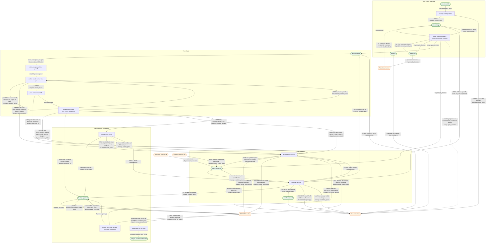

# Ticket flow map

Every path a ticket can take through factory. [Atlas](../factory/architecture.html)
shows the pieces; this map shows the paths. Edge labels cite the implementing
symbol in `factory/`; the tables below are the full index and
`tests/test_ticket_flow_map.py` fails when they drift from the code in either
direction. Operator commands live in the [README](../README.md) and skills, not here.

## Legend

| Kind | Meaning | Drawn as |
|------|---------|----------|
| View | A stage of the pipeline | subgraph |
| State | A label or durable outcome a ticket or PR can be in | stadium `([state])` |
| Action | What factory does | rectangle `[action]` |
| Out | Leaves factory: human, reporter, external CI | hexagon `{{out}}` |
| Gap | Path in code but not what the label suggests, or a path people expect that code lacks | dashed edge `-.->` |

## Map

## Gaps

- **CI `cancel` is `fail` before approval.** Since #164 the merge stage reruns a
  check cancelled before any runner picked it up (`dispatch.triage_cancelled`), but
  `manage.frontier_pass` still buckets `cancel` with `fail`, so an infrastructure
  cancel on an unapproved PR escalates as "CI failed".
- **`wontfix-proposal` means two things.** Triage only comments a wontfix proposal
  and leaves `needs-triage` (`triage.apply_decision`); manager CLOSE applies the
  `wontfix-proposal` label (`manage.apply`).
- **`needs-info` has no re-entry.** Nothing watches for the reporter's answer; a human
  puts `needs-triage` back (`dashboard.act` or GitHub).
- **Data-driven labels.** Rows marked `*` below edit labels chosen at runtime:
  the triage decision, manager ROUTE, the viability opt-in label, the dashboard
  action, and the `chore` PR label `learn.chore_pr` passes.

## Label transitions

One row per function that edits labels (`--add-label`, `--remove-label`, or
`--label` on `gh ... create`). `*` is a label chosen at runtime.

| Code | Removes | Adds | Path |
|------|---------|------|------|
| `dashboard.act` | `*` | `*` | Human action; labels limited to `dashboard.ACT_LABELS` |
| `dispatch.approve_pr` | `factory-approved` | `factory-approved` | Approve; withdraw again if the PR changed while labelling |
| `dispatch.escalate` | `ready-for-agent` | `ready-for-human` | Every escalation |
| `dispatch.merge_pass_locked` | `factory-approved` | — | CI fail, or cancel after steps ran; missing approval evidence |
| `dispatch.push_and_pr` | — | `*` | Caller's PR label; ticket PRs pass none |
| `dispatch.refresh_pr_branch` | `factory-approved` | — | Behind main: approval withdrawn before refresh |
| `dispatch.review_intake_pass` | — | `ready-for-human` | New issue for an unresolved opted-in PR review |
| `dispatch.sync_escalate` | — | `ready-for-human` | New issue for a failed upstream sync |
| `manage.apply` | `ready-for-human`, `*` | `ready-for-agent`, `needs-triage`, `wontfix-proposal`, `*` | RETRY/REWRITE/ROUTE back to agent; SPLIT children; CLOSE; ROUTE labels |
| `manage.viability_pass` | `*` | `needs-triage` | Opt-in label removed; BUILD queues triage |
| `triage.apply_decision` | `needs-triage` | `*` | `*` is the decision: `ready-for-agent`, `needs-info`, or `ready-for-human` |

## Escalate reasons

Every reason string passed to `dispatch.escalate`, `dispatch.sync_escalate`, the
`withdraw` helper in `dispatch.refresh_pr_branch`, or recorded as an `escalate`
event. `{}` is a runtime value.

| Code | Reason | Edge |
|------|--------|------|
| `dispatch.process_ticket` | ``worker edited protected paths`` | worker round → escalate |
| `dispatch.process_ticket` | ``wall-clock budget ({} min) exceeded`` | worker round → escalate |
| `dispatch.process_ticket` | ``gate failed {} times; worktree kept at {}`` | worker round → escalate |
| `dispatch.process_ticket` | ``idle_timeout fired (worker stuck) on attempt {}; worktree kept at {}`` | worker round → escalate |
| `dispatch.process_ticket` | ``agent/{}: PR not published (no commits over {} or existing PR target mismatch); inspect dispatcher log`` | push → escalate |
| `dispatch.process_ticket` | ``wall-clock budget ({} min) exceeded before bounce {}`` | review → escalate |
| `dispatch.process_ticket` | ``gate failed after review bounce {}; worktree kept at {}`` | review → escalate |
| `dispatch.process_ticket` | ``idle_timeout fired (worker stuck) after review bounce {}; worktree kept at {}`` | review → escalate |
| `dispatch.process_ticket` | ``REVISE verdict after {} review round(s)`` | review → escalate |
| `dispatch.process_ticket` | ``approval evidence, head, or human review state changed before approval`` | review → escalate |
| `dispatch.merge_pass_locked` | ``PR #{}: CI failed ({}); `{}` label removed`` | CI fail → escalate |
| `dispatch.runner_unavailable` | ``PR #{}: CI runner unavailable ({}) in run {}; `{}` kept`` | CI no runner after rerun → escalate |
| `dispatch.merge_pass_locked` | ``PR #{}: missing approval evidence bound to {}; `{}` label removed`` | CI pass, missing evidence → escalate |
| `dispatch.refresh_pr_branch` | ``PR #{}: could not remove stale `{}` approval`` | refresh → escalate |
| `dispatch.refresh_pr_branch` | ``PR #{}: {}; `{}` label removed`` | refresh → escalate (wraps the reasons below) |
| `dispatch.refresh_pr_branch` | ``kept worktree head {} differs from remote head {}`` | refresh → escalate |
| `dispatch.refresh_pr_branch` | ``{} onto moved main conflicts; worktree {}`` | refresh → escalate |
| `dispatch.refresh_pr_branch` | ``nothing ahead of {} after {}; refusing to push`` | refresh → escalate |
| `dispatch.refresh_pr_branch` | ``gate failed after {} onto moved main`` | refresh → escalate |
| `dispatch.refresh_pr_branch` | ``remote head changed while refreshed evidence was being produced`` | refresh → escalate |
| `dispatch.refresh_pr_branch` | ``fresh review requested changes after {} onto moved main`` | refresh → escalate |
| `dispatch.refresh_pr_branch` | ``approval evidence, head, or human review state changed before refreshed approval`` | refresh → escalate |
| `dispatch.review_intake_pass` | ``PR #{}: unresolved after {} automated review attempt(s)`` | external PR → ready-for-human |
| `dispatch.sync_pass` | ``merge conflict`` | upstream → ready-for-human |
| `dispatch.sync_pass` | ``gate failed`` | upstream → ready-for-human |
| `manage.frontier_pass` | ``PR #{}: CI failed ({})`` | manager PR frontier → escalate |
| `manage.frontier_pass` | ``PR #{}: {} unresolved feedback item(s) on head {}`` | manager PR frontier → escalate |
| `manage.frontier_pass` | ``PR #{}: no activity for {} days (stale_days = {})`` | manager PR frontier → escalate |
| `manage.frontier_pass` | ``PR #{}: manager rounds exhausted before approval`` | manager PR frontier → escalate |
| `manage.frontier_pass` | ``PR #{}: approval evidence, head, or human review state changed before manager approval`` | manager PR frontier → escalate |
| `manage.frontier_pass` | ``PR #{}: manager requires a human: {}`` | manager PR frontier → escalate |
| `manage.apply` | ``gate failed after manager FIX`` | manager FIX → escalate |
| `manage.apply` | ``review requested changes after manager FIX`` | manager FIX → escalate |
| `manage.apply` | ``approval evidence, head, or human review state changed before manager FIX approval`` | manager FIX → escalate |
| `manage.escalation_pass` | ``manager_failed`` | manager decision → human |
